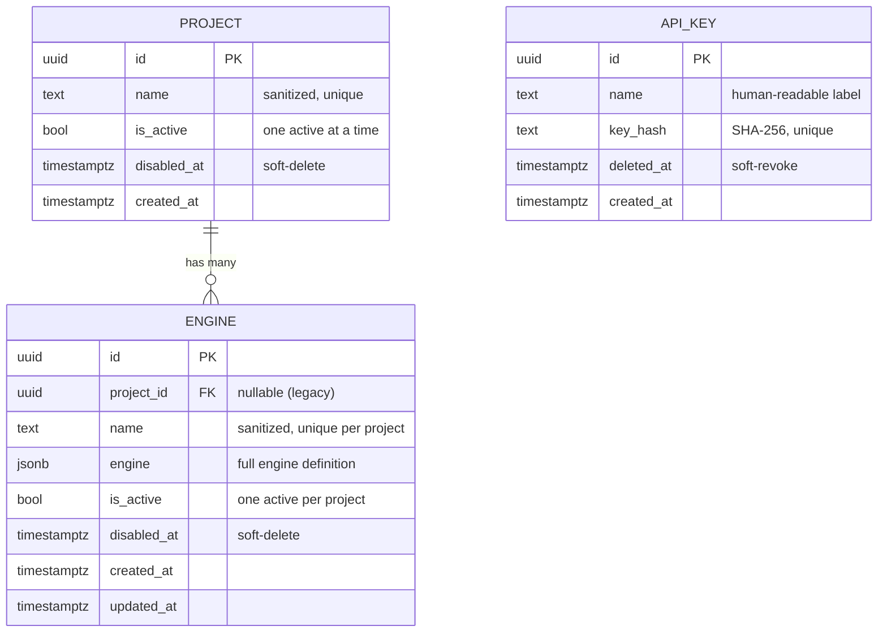
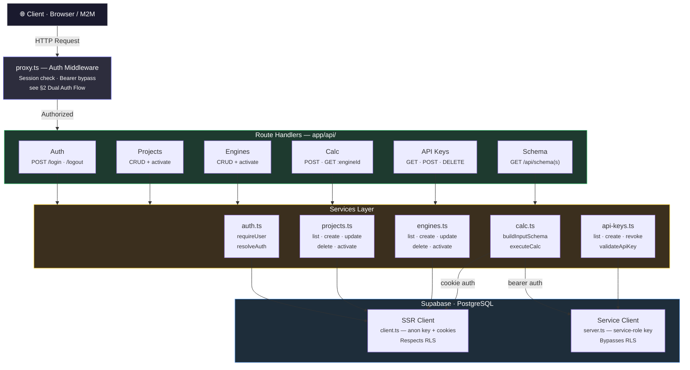
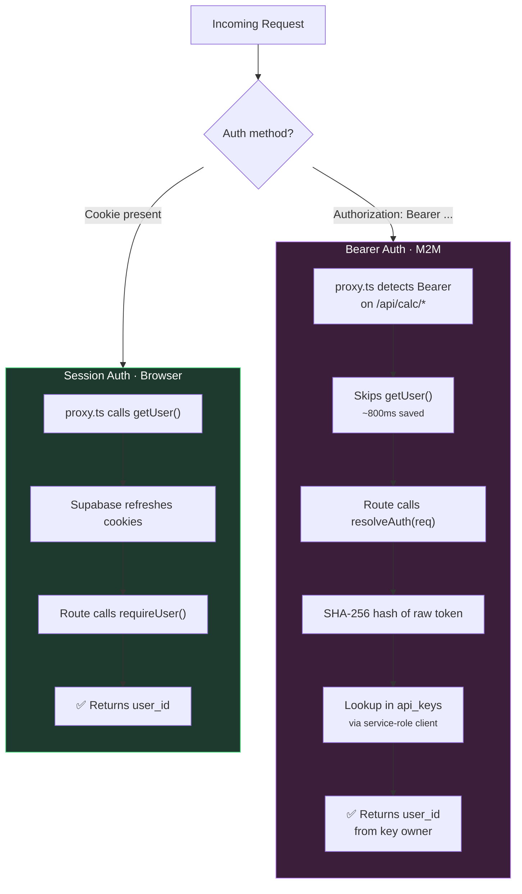
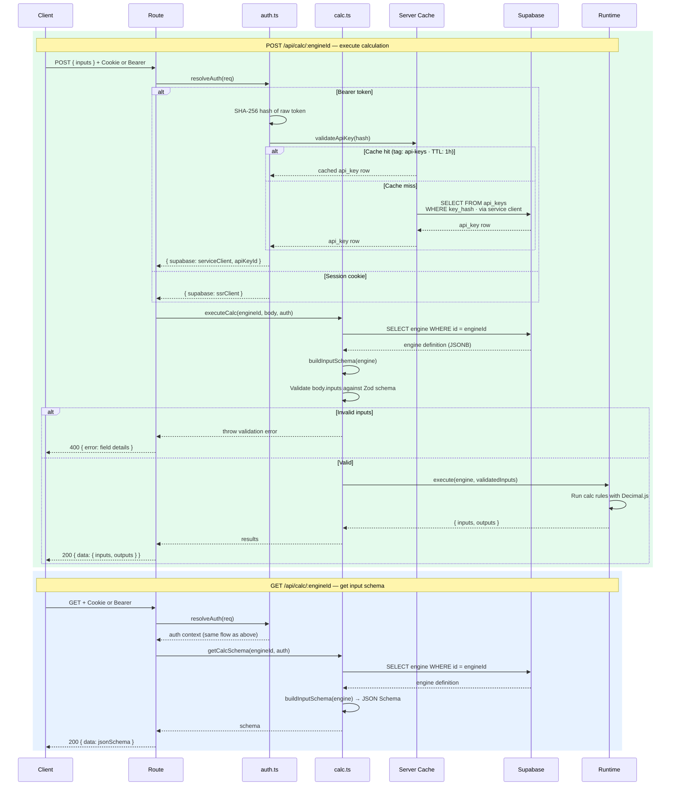
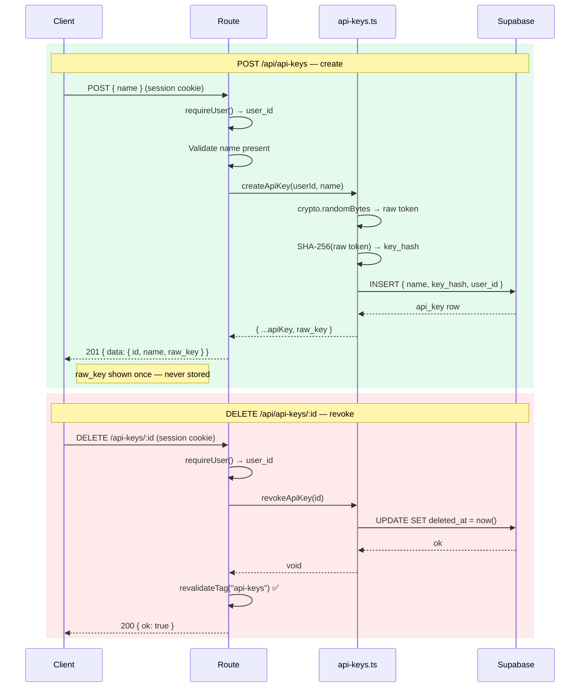
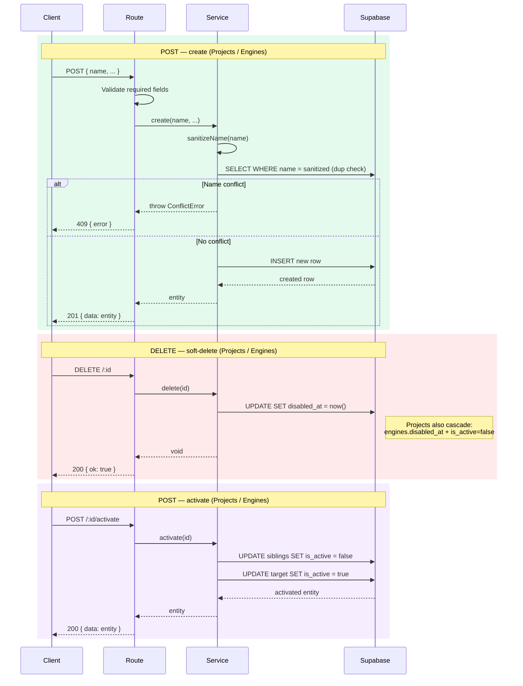

# API Communication Flow

> Visual overview of domain model, request lifecycle, auth strategies, and detailed endpoint flows.

## Summary

| Section | What it covers |
|---------|---------------|
| [§1 Domain Model](#1-domain-model) | Core entities and relationships (Project → Engine, API Key) |
| [§2 Request Lifecycle](#2-request-lifecycle) | How every HTTP request flows through proxy → routes → services → DB |
| [§3 Dual Auth Flow](#3-dual-auth-flow) | Session (cookie) vs Bearer (API key) authentication strategies |
| [§4 API Endpoints Summary](#4-api-endpoints-summary) | Quick-reference table of all endpoints — public and internal |
| [§5 Endpoint Flows](#5-endpoint-flows) | Sequence diagrams showing what each endpoint does step-by-step |
| [§6 Cache & Revalidation](#6-cache--revalidation) | Cache tags, invalidation strategy, and observability |

---

## 1. Domain Model

The core entities and their relationships. Understanding these first makes the rest of the doc easier to follow.



## 2. Request Lifecycle

How every HTTP request flows through the system — from client to database and back.



## 3. Dual Auth Flow

Two authentication strategies coexist — session-based for browsers, Bearer token for machine-to-machine.



## 4. API Endpoints Summary

Endpoints are split into two surfaces based on intended consumer:

### 4.1 Public API — External Service Contract

Stable endpoints consumed by third-party integrations via API key (Bearer token). These form the external service contract — breaking changes require versioning.

| Resource | Method | Path | Auth | Service | Revalidates |
|----------|--------|------|------|---------|-------------|
| **Calc** | POST | `/api/calc/:engineId` | Session / Bearer | `calc.calculate` | — |
| | GET | `/api/calc/:engineId` | Session / Bearer | `calc.getCalcSchema` | — |

### 4.2 Internal API — Frontend Only

Used exclusively by the Next.js frontend. Contract may change without notice. Not intended for external consumption — unauthenticated requests without a session cookie receive a redirect to `/login` (not a `401`).

| Resource | Method | Path | Auth | Service | Revalidates |
|----------|--------|------|------|---------|-------------|
| **Auth** | POST | `/api/auth/login` | Public | Supabase Auth | — |
| | POST | `/api/auth/logout` | Session | Supabase Auth | — |
| **Projects** | GET | `/api/projects` | Session | `projects.listProjects` | — |
| | POST | `/api/projects` | Session | `projects.createProject` | — |
| | PATCH | `/api/projects/:id` | Session | `projects.updateProject` | `TODO: projects` |
| | DELETE | `/api/projects/:id` | Session | `projects.deleteProject` | `TODO: projects, engines` |
| | POST | `/api/projects/:id/activate` | Session | `projects.activateProject` | `TODO: projects` |
| | GET | `/api/projects/active` | Session | `projects.getActiveProject` | — |
| | GET | `/api/projects/:id/engines` | Session | `engines.listEngines` | — |
| | POST | `/api/projects/:id/engines` | Session | `engines.createEngine` | — |
| | GET | `/api/projects/:id/engines/active` | Session | `engines.getActiveEngine` | — |
| **Engines** | GET | `/api/engines` | Session | `engines.listEngines` | — |
| | POST | `/api/engines` | Session | `engines.createEngine` | — |
| | PATCH | `/api/engines/:id` | Session | `engines.updateEngine` | `TODO: engines` |
| | DELETE | `/api/engines/:id` | Session | `engines.deleteEngine` | `TODO: engines` |
| | POST | `/api/engines/:id/activate` | Session | `engines.activateEngine` | `TODO: engines` |
| | GET | `/api/engines/active` | Session | `engines.getActiveEngine` | — |
| **API Keys** | GET | `/api/api-keys` | Session | `apiKeys.listApiKeys` | — |
| | POST | `/api/api-keys` | Session | `apiKeys.createApiKey` | — |
| | DELETE | `/api/api-keys/:id` | Session | `apiKeys.revokeApiKey` | `api-keys` ✅ |
| **Schema** | GET | `/api/schema` | Session | Static registry | — |
| | GET | `/api/schemas/:resource/:action` | Session | Static registry | — |

## 5. Endpoint Flows

Sequence diagrams for the non-trivial flows. Simple CRUD endpoints (list, get active, etc.) follow the standard pattern shown in §5.3 — see §4 for the full endpoint reference.

> **Color legend:** 🔵 GET · 🟢 POST · 🟡 PATCH · 🔴 DELETE · 🟣 POST activate

### 5.1 Calc

The most complex flow — dual auth resolution, engine lookup, dynamic schema validation, and arithmetic execution via Decimal.js runtime.



### 5.2 API Keys

Key generation uses crypto-random tokens with SHA-256 hashing — the raw key is returned once and never stored. Revocation invalidates the server cache immediately.



### 5.3 CRUD Pattern

All Projects and Engines endpoints follow this pattern. The create flow below applies to both `POST /api/projects` and `POST /api/engines` — update (PATCH) is identical but with `UPDATE` instead of `INSERT`.



> **GET endpoints** (list, active) are straightforward: `Route → Service → SELECT → return`. See §4 for the full list.

## 6. Cache & Revalidation

Server-side caching uses the Next.js **Data Cache** with named **tags**. A cached function stores its result on first call; subsequent calls return the cached value until the TTL expires or `revalidateTag("tag")` is called to bust it on-demand. Mutation routes call `revalidateTag()` immediately after writes to keep the cache fresh.

The "Revalidates" column in §4 references tags defined here.

### Current cache tags

| Tag | What is cached | Invalidated by | TTL |
|-----|---------------|----------------|-----|
| `api-keys` | `validateApiKey` — lookup by SHA-256 hash | `DELETE /api/api-keys/:id` | 1 hour |

### Planned cache tags (TODO)

| Tag | Should cache | Should be invalidated by | TTL |
|-----|-------------|--------------------------|-----|
| `projects` | `listProjects`, `getActiveProject` | `PATCH /api/projects/:id`, `DELETE /api/projects/:id`, `POST /api/projects/:id/activate` | TBD |
| `engines` | `listEngines`, `getActiveEngine` | `PATCH /api/engines/:id`, `DELETE /api/engines/:id`, `POST /api/engines/:id/activate` | TBD |
| `engine:${engineId}` | `getEngineDefinition` (published only) | Never — published engines are immutable | ∞ (`revalidate: false`) |

> **Note:** `DELETE /api/projects/:id` should also invalidate `engines` because it orphans all engines in that project (`project_id = null`, `is_active = false`).
>
> **Note:** The `engine:${engineId}` tag uses per-engine granularity. Published engines are write-once/read-forever, so the cache never needs invalidation. Draft engines bypass cache entirely (direct DB query). The tag exists for emergency surgical invalidation if ever needed.

### Observability

All cached lookups log their source via Pino for production monitoring:

```
logger.info({ engineId, source: "cache" }, "engines.getDefinition")  // published, cache hit
logger.info({ engineId, source: "db" },    "engines.getDefinition")  // draft or cache miss
```

This allows measuring cache hit rate and verifying cache behavior in New Relic / log aggregation.
