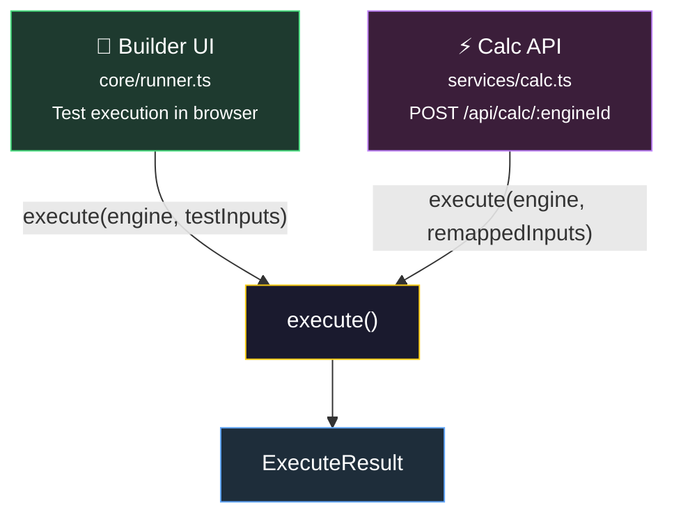
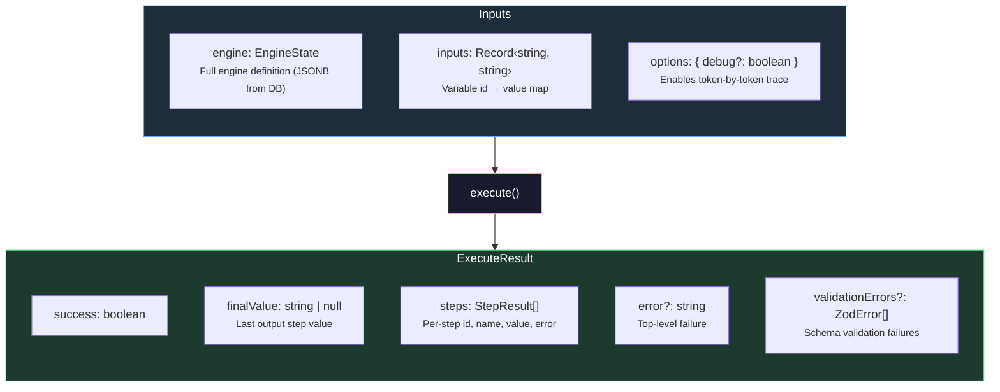
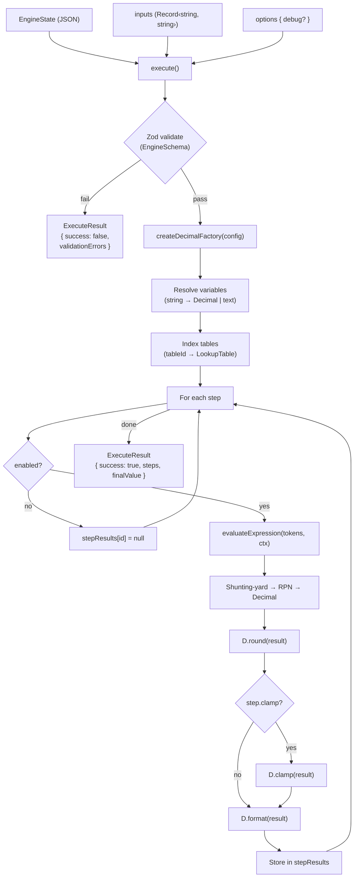
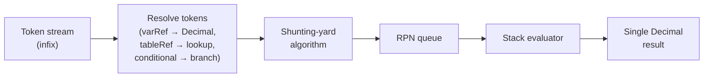
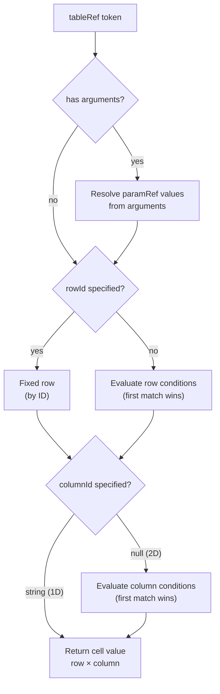
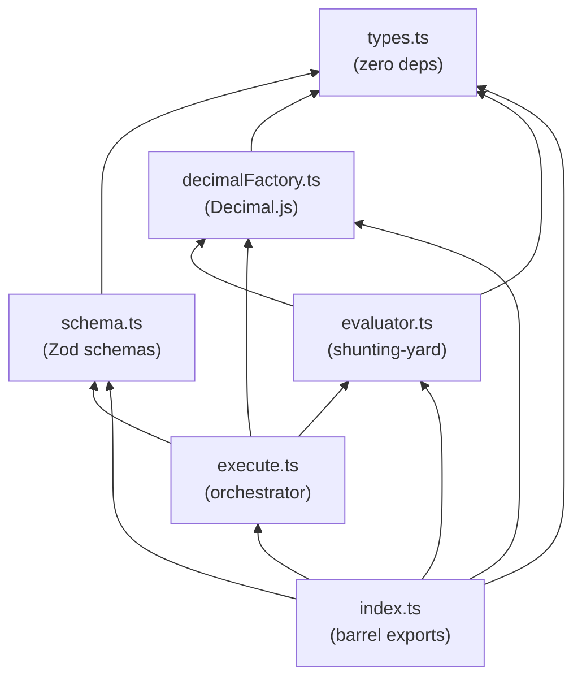
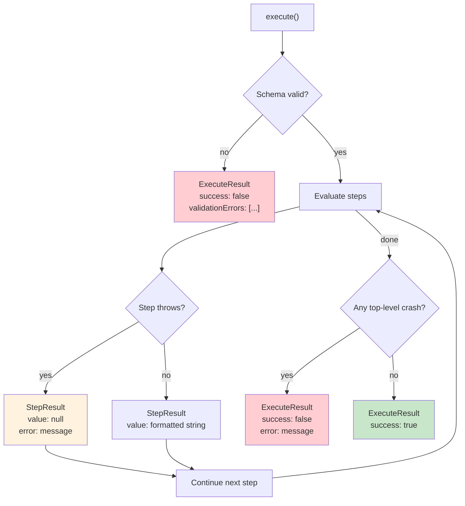

# calc-engine-runtime

> Stateless, JSON-driven calculation engine with arbitrary-precision arithmetic,
> lookup tables (1D/2D, parameterized), conditional branching, and full debug tracing.

[](#)
[](#)
[](#)
[](#)

---

## Runtime Contract

The runtime is a **pure function** — no I/O, no side effects, fully deterministic.

### Consumers — who calls `execute()`



### Interface — inputs and outputs



**Properties:** Stateless (zero I/O) · Deterministic (same inputs = same outputs) · Self-validating (Zod validates engine JSON before execution)

---

## Highlights

- **Stateless execution** — pure function: `EngineState` + inputs → results. No side effects, no I/O.
- **Arbitrary-precision arithmetic** — Decimal.js with configurable precision, rounding modes, and min/max clamping.
- **Lookup tables** — 1D (fixed column), 2D (runtime column resolution), parameterized (reusable with arguments).
- **Conditional branching** — IF/ELSE IF/ELSE tokens inline in expressions.
- **Zod validation** — full schema validation at runtime with structured error reporting.
- **Debug traces** — opt-in token-by-token evaluation trace for every step.
- **Sub-millisecond p99** — production engines (≤ 15 steps) execute in < 1ms at p99.
- **All values are strings** — no JSON float precision loss. Ever.

---

## Install

> **Note:** Currently embedded in a Next.js monorepo at `libs/runtime/`.
> Extraction as a standalone npm package is planned.

```ts
// Monorepo import
import { execute } from "@/libs/runtime"

// Future standalone package
// import { execute } from "calc-engine-runtime"
```

---

## Quick Start

### Minimal — single variable × constant

```ts
import { execute } from "@/libs/runtime"

const engine = {
  name: "simple",
  config: { precision: 2, rounding: "ROUND_HALF_UP", min: null, max: null },
  variables: [
    { id: "v1", name: "valor", defaultValue: "100" }
  ],
  tables: [],
  steps: [
    {
      id: "s1", name: "resultado", enabled: true,
      expression: [
        { type: "varRef", target: "v1" },
        { type: "op", value: "*" },
        { type: "number", value: "0.1" }
      ]
    }
  ]
}

const result = execute(engine, { v1: "500" })
// result.success    → true
// result.finalValue → "50.00"
// result.steps[0]   → { id: "s1", name: "resultado", value: "50.00", ... }
```

### Table lookup — rate by revenue range

```ts
const engine = {
  name: "rate_lookup",
  config: { precision: 4, rounding: "ROUND_HALF_UP", min: null, max: null },
  variables: [
    { id: "v1", name: "revenue", defaultValue: "0" }
  ],
  tables: [{
    id: "t1", name: "rates",
    columns: [{ id: "col1", label: "Rate" }],
    rows: [
      { id: "r1", condition: { left: { kind: "varRef", target: "v1" }, op: "<=", right: { kind: "number", value: "100000" } }, values: { col1: "0.05" } },
      { id: "r2", condition: { left: { kind: "varRef", target: "v1" }, op: "<=", right: { kind: "number", value: "500000" } }, values: { col1: "0.03" } },
      { id: "r3", condition: null, values: { col1: "0.02" } }
    ]
  }],
  steps: [{
    id: "s1", name: "premium", enabled: true,
    expression: [
      { type: "varRef", target: "v1" },
      { type: "op", value: "*" },
      { type: "tableRef", tableId: "t1", columnId: "col1", rowId: null }
    ]
  }]
}

execute(engine, { v1: "250000" })
// → { success: true, finalValue: "7500.0000" }
```

### Debug mode — token-by-token trace

```ts
const result = execute(engine, { v1: "250000" }, { debug: true })

result.steps[0].trace.tokens
// [
//   { type: "varRef",    resolved: "250000.0000", detail: "variável: v1" },
//   { type: "op",        resolved: "*" },
//   { type: "tableRef",  resolved: "0.0300",      detail: "tabela: rates, linha 2: Medium" }
// ]
```

---

## Architecture

### Execution Pipeline



### Expression Evaluation (Shunting-Yard)



### Table Resolution Flow



### Module Dependency Graph



---

## API Reference

### `execute(engine, inputs?, options?)`

Main entry point. Validates the engine definition, creates a decimal factory, and evaluates all steps in order.

```ts
function execute(
  engine: unknown,
  inputs?: Record<string, string>,
  options?: { debug?: boolean }
): ExecuteResult
```

| Parameter | Type | Default | Description |
|-----------|------|---------|-------------|
| `engine` | `unknown` | — | Engine definition. Validated at runtime via `EngineSchema`. |
| `inputs` | `Record<string, string>` | `{}` | Variable `id → value` map. Missing keys fall back to `defaultValue`. |
| `options.debug` | `boolean` | `false` | When `true`, includes `TokenTrace[]` in each step result. |

**Returns:** [`ExecuteResult`](#executeresult)

**Behavior:**
1. Validates `engine` against `EngineSchema` (Zod). Returns validation errors on failure.
2. Creates `DecimalFactory` from `engine.config`.
3. Resolves variables: numeric → `Decimal`, text → `string`.
4. Evaluates each enabled step in order via `evaluateExpression()`.
5. Applies `round()` to every step result, `clamp()` only when `step.clamp: true`.
6. Returns `finalValue` from the last successful `"output"` step.

---

### `evaluateExpression(tokens, ctx)`

Shunting-yard expression evaluator. Resolves all token types and produces a single `Decimal` value.

```ts
function evaluateExpression(
  tokens: ExpressionToken[],
  ctx: EvalContext
): Decimal
```

| Parameter | Type | Description |
|-----------|------|-------------|
| `tokens` | `ExpressionToken[]` | Token array defining the expression. |
| `ctx` | `EvalContext` | Resolution context (variables, step results, tables, factory). |

**Returns:** `Decimal` — the raw result before rounding/formatting.

**Throws:** On empty expression, unbalanced parentheses, missing references, division by zero, or Infinity/NaN result.

---

### `createDecimalFactory(config)`

Creates a configured arithmetic toolkit for a single engine execution.

```ts
function createDecimalFactory(config: EngineConfig): DecimalFactory
```

| Parameter | Type | Description |
|-----------|------|-------------|
| `config` | `EngineConfig` | Precision, rounding mode, and min/max clamp values. |

**Returns:** [`DecimalFactory`](#decimalfactory-1) — object with `from`, `add`, `sub`, `mul`, `div`, `mod`, `round`, `clamp`, `format`.

**Key detail:** Internal precision is `config.precision + 10` to prevent cascading rounding errors in chained operations. → [docs/DecimalFactory.md](docs/DecimalFactory.md)

---

### `validateParens(tokens)`

Checks that parentheses in a token array are balanced.

```ts
function validateParens(tokens: ExpressionToken[]): boolean
```

Returns `true` if all `(` have matching `)`, `false` otherwise.

---

### `EngineSchema`

Zod schema for `EngineState`. Used for runtime validation and JSON Schema generation.

```ts
import { EngineSchema } from "@/libs/runtime"

// Runtime validation
const parsed = EngineSchema.safeParse(unknownData)

// JSON Schema generation
import { z } from "zod"
const jsonSchema = z.toJSONSchema(EngineSchema)
```

**Validations include:**
- All field types and shapes (recursive, including nested tokens)
- Name format: `^[a-z][a-z0-9_]*$`, max 64 chars
- Uniqueness: no duplicate names within variables, steps, or tables
- Discriminated unions: `ExpressionToken` (by `type`), `TableConditionSide` (by `kind`)

---

## Complete Type Contract

All types are defined in [`types.ts`](types.ts) and re-exported from [`index.ts`](index.ts).

### EngineState

Top-level engine definition — the single JSON document that fully describes a calculation engine.

| Field | Type | Required | Description |
|-------|------|----------|-------------|
| `name` | `string` | ✅ | Unique identifier. `^[a-z][a-z0-9_]*$`, max 64 chars. |
| `config` | [`EngineConfig`](#engineconfig) | ✅ | Arithmetic settings. |
| `variables` | [`Variable[]`](#variable) | ✅ | Inputs and constants. |
| `tables` | [`LookupTable[]`](#lookuptable) | ✅ | Lookup tables (can be `[]`). |
| `steps` | [`Step[]`](#step) | ✅ | Calculation steps, evaluated in order. |

### EngineConfig

| Field | Type | Required | Default | Description |
|-------|------|----------|---------|-------------|
| `precision` | `number` (positive int) | ✅ | — | Decimal places for output. Internal precision is `+10`. |
| `rounding` | `RoundingMode` | ✅ | — | `"ROUND_HALF_UP"` · `"ROUND_DOWN"` · `"ROUND_HALF_EVEN"` |
| `min` | `string \| null` | ✅ | — | Lower clamp bound. `null` = no limit. |
| `max` | `string \| null` | ✅ | — | Upper clamp bound. `null` = no limit. |

### Variable

| Field | Type | Required | Default | Description |
|-------|------|----------|---------|-------------|
| `id` | `string` | ✅ | — | Unique ID (referenced by `varRef` tokens). |
| `name` | `string` | ✅ | — | Display name. Must match naming convention. |
| `defaultValue` | `string` | ✅ | — | Fallback when no input provided. |
| `unit` | `string` | ❌ | — | Display-only unit (e.g. `"%"`, `"R$"`). Not used in calculation. |
| `kind` | `"input" \| "constant"` | ❌ | `"input"` | `input` = runtime-provided. `constant` = engine-fixed. |
| `valueType` | `"number" \| "text"` | ❌ | `"number"` | `text` vars are string-typed, valid only in `==`/`!=` conditions. |

### Step

| Field | Type | Required | Default | Description |
|-------|------|----------|---------|-------------|
| `id` | `string` | ✅ | — | Unique ID (referenced by `stepRef` tokens). |
| `name` | `string` | ✅ | — | Display name. Must match naming convention. |
| `enabled` | `boolean` | ✅ | — | `false` → step is skipped, result is `null`. |
| `kind` | `"internal" \| "output"` | ❌ | `"output"` | `output` = key result. `internal` = intermediate helper. |
| `clamp` | `boolean` | ❌ | `false` | If `true`, result is constrained to `[config.min, config.max]`. |
| `expression` | [`ExpressionToken[]`](#expressiontoken) | ✅ | — | Token array defining the calculation. |

### LookupTable

| Field | Type | Required | Description |
|-------|------|----------|-------------|
| `id` | `string` | ✅ | Unique ID (referenced by `tableRef` tokens). |
| `name` | `string` | ✅ | Display name. Must match naming convention. |
| `rowLabelHeader` | `string` | ❌ | Header for row labels column (UI only). |
| `parameters` | `string[]` | ❌ | Parameter names — makes table parameterized. |
| `columns` | [`TableColumn[]`](#tablecolumn) | ✅ | Column definitions. |
| `rows` | [`TableRow[]`](#tablerow) | ✅ | Row definitions with conditions and values. |

### TableColumn

| Field | Type | Required | Description |
|-------|------|----------|-------------|
| `id` | `string` | ✅ | Unique column ID. |
| `label` | `string` | ✅ | Display name. |
| `condition` | `TableCondition \| null \| undefined` | ❌ | `undefined` = 1D (selected by ID). `TableCondition` = 2D (runtime). `null` = default/else column. |

### TableRow

| Field | Type | Required | Description |
|-------|------|----------|-------------|
| `id` | `string` | ✅ | Unique row ID. |
| `label` | `string` | ❌ | Display label (UI only). |
| `condition` | `TableCondition \| null` | ✅ | Row selection condition. `null` = default/else row (should be last). |
| `values` | `Record<string, string>` | ✅ | Cell values keyed by column `id`. |

### TableCondition

| Field | Type | Description |
|-------|------|-------------|
| `left` | [`TableConditionSide`](#tableconditionside) | Left-hand side of comparison. |
| `op` | [`CompareOp`](#compareop) | Comparison operator. |
| `right` | [`TableConditionSide`](#tableconditionside) | Right-hand side of comparison. |

### TableConditionSide

Discriminated union on `kind` (not `type` — [see why](docs/EngineState.md#why-kind-vs-type)):

| Kind | Shape | Description |
|------|-------|-------------|
| `number` | `{ kind: "number", value: string }` | Literal numeric value. |
| `text` | `{ kind: "text", value: string }` | Literal text. Only valid in `==`/`!=`. |
| `varRef` | `{ kind: "varRef", target: string }` | Variable reference by `id`. |
| `stepRef` | `{ kind: "stepRef", target: string }` | Step result reference by `id`. |
| `paramRef` | `{ kind: "paramRef", target: string }` | Table parameter reference. Only inside parameterized tables. |

### CompareOp

| Operator | Meaning | Numeric | Text |
|----------|---------|:-------:|:----:|
| `<` | Less than | ✅ | ❌ |
| `<=` | Less than or equal | ✅ | ❌ |
| `==` | Equal | ✅ | ✅ |
| `>=` | Greater than or equal | ✅ | ❌ |
| `>` | Greater than | ✅ | ❌ |
| `!=` | Not equal | ✅ | ✅ |

### ExpressionToken

Discriminated union on `type`:

| Type | Shape | Description |
|------|-------|-------------|
| `number` | `{ type: "number", value: string }` | Literal numeric value. |
| `op` | `{ type: "op", value: "+" \| "-" \| "*" \| "/" \| "%" }` | Arithmetic operator. |
| `paren` | `{ type: "paren", value: "(" \| ")" }` | Grouping parenthesis. |
| `varRef` | `{ type: "varRef", target: string }` | Variable reference. Numeric only. |
| `stepRef` | `{ type: "stepRef", target: string }` | Prior step result reference. |
| `tableRef` | `{ type: "tableRef", tableId, columnId, rowId?, arguments? }` | Lookup table reference. |
| `conditional` | `{ type: "conditional", branches: [...], elseToken }` | IF/ELSE branching. |

### ScalarToken

Subset of `ExpressionToken` valid inside conditional branches: `number`, `varRef`, `stepRef`, `tableRef`.
No operators, parentheses, or nested conditionals.

### ExecuteResult

| Field | Type | Description |
|-------|------|-------------|
| `success` | `boolean` | `true` if execution completed (even if individual steps errored). |
| `steps` | [`StepResult[]`](#stepresult) | Per-step results in evaluation order. |
| `finalValue` | `string \| null` | Value of the last successful `"output"` step. |
| `error` | `string` | Top-level error message (validation failure, unexpected crash). |
| `validationErrors` | `{ path: (string \| number)[], message: string }[]` | Zod validation errors when `success: false`. |

### StepResult

| Field | Type | Description |
|-------|------|-------------|
| `id` | `string` | Step identifier. |
| `name` | `string` | Step name. |
| `enabled` | `boolean` | Whether the step was evaluated. |
| `value` | `string \| null` | Formatted result (with `config.precision` decimal places), or `null` if disabled/errored. |
| `error` | `string \| null` | Error message if the step failed. |
| `trace` | [`StepTrace`](#steptrace) | Token-level trace (only when `debug: true`). |

### StepTrace

| Field | Type | Description |
|-------|------|-------------|
| `tokens` | [`TokenTrace[]`](#tokentrace) | Token-by-token evaluation details. |

### TokenTrace

| Field | Type | Description |
|-------|------|-------------|
| `type` | `string` | Token type: `"varRef"`, `"tableRef"`, `"conditional"`, `"number"`, `"op"`, `"paren"`. |
| `resolved` | `string` | Resolved value as formatted string (or operator symbol). |
| `detail` | `string` | Human-readable context: variable name, matched table row, branch info. |

### EvalContext

| Field | Type | Description |
|-------|------|-------------|
| `variables` | `Record<string, Decimal>` | Numeric variable values. |
| `textVariables` | `Record<string, string>` | Text variable values. |
| `stepResults` | `Record<string, Decimal \| null>` | Prior step results. |
| `tables` | `Record<string, LookupTable>` | Indexed lookup tables. |
| `D` | [`DecimalFactory`](#decimalfactory-1) | Configured arithmetic toolkit. |
| `trace` | `TokenTrace[]` | Accumulator for debug traces (present only in debug mode). |
| `tableParams` | `Record<string, string>` | Resolved parameter values (only during parameterized table evaluation). |

### DecimalFactory

| Method | Signature | Description |
|--------|-----------|-------------|
| `from` | `(v: string \| number) → Decimal` | Parse value into Decimal. |
| `add` | `(a: Decimal, b: Decimal) → Decimal` | Addition. |
| `sub` | `(a: Decimal, b: Decimal) → Decimal` | Subtraction. |
| `mul` | `(a: Decimal, b: Decimal) → Decimal` | Multiplication. |
| `div` | `(a: Decimal, b: Decimal) → Decimal` | Division. Throws on zero. |
| `mod` | `(a: Decimal, b: Decimal) → Decimal` | Modulo. Throws on zero. |
| `round` | `(v: Decimal) → Decimal` | Round to `config.precision` with configured mode. |
| `clamp` | `(v: Decimal) → Decimal` | Constrain to `[config.min, config.max]`. |
| `format` | `(v: Decimal) → string` | Fixed-point string with exactly `precision` decimal places. |

---

## Operator Precedence

| Precedence | Operators | Associativity |
|:----------:|-----------|:-------------:|
| 3 (high) | `*`  `/`  `%` | Left |
| 2 (low) | `+`  `-` | Left |

Parentheses `(` `)` override precedence. The evaluator uses the standard
[shunting-yard algorithm](https://en.wikipedia.org/wiki/Shunting-yard_algorithm)
to convert infix token streams to RPN, then evaluates via stack.

---

## Table Resolution Modes

| Mode | `columnId` | `rowId` | Resolution |
|------|:----------:|:-------:|------------|
| **1D** | `"col1"` | `null` | Column fixed at design time, row resolved by conditions at runtime. |
| **2D** | `null` | `null` | Both row and column resolved by conditions at runtime. |
| **Fixed row** | `"col1"` | `"r1"` | Both fixed at design time. Direct cell lookup. |
| **Parameterized** | any | any | Table has `parameters[]`. Token provides `arguments` mapping params → values. |

Row conditions are evaluated **top-to-bottom** — first match wins.
A row with `condition: null` acts as the default/else and should be last.

→ Deep dive: [docs/EngineState.md — LookupTable](docs/EngineState.md#lookuptable)

---

## Rounding & Precision

Three rounding modes are supported, configured per engine in `config.rounding`:

| Mode | Behavior | Use case |
|------|----------|----------|
| `ROUND_HALF_UP` | 0.5 → round up (away from zero) | Financial/actuarial (default) |
| `ROUND_DOWN` | Always truncate toward zero | Conservative estimates |
| `ROUND_HALF_EVEN` | 0.5 → round to nearest even (Banker's) | Bias reduction in large datasets |

**Key design:** Internal precision is `config.precision + 10`. Arithmetic operations
run at full precision; rounding is applied **once per step**, not per operation.

→ Deep dive: [docs/DecimalFactory.md](docs/DecimalFactory.md)

---

## Validation

`EngineSchema` validates the full `EngineState` JSON at runtime. Validation errors are
returned in `ExecuteResult.validationErrors` with path and message.

| Rule | Example error |
|------|---------------|
| Name format | `invalid name: use [a-z0-9_], must start with a letter` |
| Duplicate variable name | `duplicate variable name: "rate"` |
| Duplicate step name | `duplicate step name: "total"` |
| Duplicate table name | `duplicate table name: "rates"` |
| Invalid token discriminator | Zod discriminated union error on `type` or `kind` |
| Missing required fields | Standard Zod `required` errors |

---

## Error Handling

Errors are categorized and surfaced at different levels:



| Error category | Level | Example |
|----------------|-------|---------|
| **Validation** | `ExecuteResult.validationErrors` | Invalid schema, duplicate names |
| **Step error** | `StepResult.error` | Missing variable, disabled step reference, division by zero |
| **Top-level** | `ExecuteResult.error` | Unexpected crash during factory creation |

**Design:** Individual step errors do **not** halt execution. Subsequent steps that
don't depend on the failed step continue normally. Steps that reference a failed step
will also error (cascading failure is localized, not global).

---

## Debug Mode

Pass `{ debug: true }` as the third argument to `execute()` to get a full token-by-token
evaluation trace for every step.

```ts
const result = execute(engine, inputs, { debug: true })

for (const step of result.steps) {
  if (step.trace) {
    for (const t of step.trace.tokens) {
      console.log(`${t.type} → ${t.resolved} ${t.detail ?? ""}`)
    }
  }
}
```

**Example trace output:**

```
varRef     → 250000.0000   variável: v1
op         → *
tableRef   → 0.0300        tabela: rates, linha 2: Medium
```

Trace detail varies by token type:

| Token type | Detail format |
|------------|---------------|
| `varRef` | `variável: {target}` |
| `stepRef` | `etapa: {target}` |
| `tableRef` (1D) | `tabela: {name}, linha {n}: {label}` |
| `tableRef` (2D) | `tabela: {name}, linha: {rowLabel}, coluna: {colLabel}` |
| `conditional` (branch) | `branch {n} matched: {left} {op} {right}` |
| `conditional` (else) | `else` |
| `number`, `op`, `paren` | (no detail) |

---

## Performance

Production engines (≤ 15 steps, ≤ 2 tables) execute in **< 1ms at p99**. The
runtime is the fastest layer in the full request stack — invisible in total
latency budget.

### Measured Results (baseline 2026-04-20)

| Scenario | Steps | Tables | p99 measured | p99 target | hz | Status |
|----------|:-----:|:------:|:-----------:|:----------:|---:|:------:|
| **motor_rcg (real engine)** | real | real | **0.996ms** | < 1ms | 1,816/s | ✅ |
| Small (synthetic) | 10 | 2 × 500 rows | **0.896ms** | < 1ms | 1,891/s | ✅ |
| Medium (synthetic) | 30 | 5 × 500 rows | **1.792ms** | < 3ms | 817/s | ✅ |
| Large (synthetic) | 80 | 10 × 500 rows | **13.952ms** | < 10ms | 333/s | ⚠️ |

> **Large** exceeds target — synthetic worst-case, no production engine at this scale.
> Optimization (compile/run split) deferred until a real trigger fires.

### Raw Benchmark Output

```
✓ execute() — small (10 steps, 2 tables × 500 rows)
   · execute  1,891.37 hz  min 0.47ms  mean 0.53ms  p99 0.90ms  ±1.49%

✓ execute() — medium (30 steps, 5 tables × 500 rows)
   · execute    817.10 hz  min 1.11ms  mean 1.22ms  p99 1.79ms  ±1.22%

✓ execute() — large (80 steps, 10 tables × 500 rows)
   · execute    332.68 hz  min 2.40ms  mean 3.01ms  p99 13.95ms ±7.92%

✓ execute() — motor_rcg (real production engine)
   · execute  1,816.27 hz  min 0.50ms  mean 0.55ms  p99 1.00ms  ±2.03%
```

### Where execute() sits in the request stack

```
HTTP request (network):      ~5–20ms
Next.js middleware:           ~1–3ms
Supabase (if used):          ~10–50ms
→ execute() ← THIS LAYER:   ~0.5–1ms (p99)
Response serialization:       ~1ms
──────────────────────────────────────
Total perceived latency:     ~20–75ms
```

At < 1ms p99, the runtime is **invisible** in the total budget.

```bash
# Run benchmarks
yarn bench:fixtures   # generate synthetic fixtures (first time)
yarn bench            # run all benchmarks
```

→ Full benchmark methodology, p99 classification scale, and optimization triggers: [__bench__/README.md](__bench__/README.md)
→ Baseline snapshot with detailed analysis: [__bench__/baseline/2026-04-20-pre-compile-run.md](__bench__/baseline/2026-04-20-pre-compile-run.md)

---

## File Structure

```
libs/runtime/
├── types.ts              # All TypeScript types (zero deps)
├── schema.ts             # Zod schemas mirroring types.ts
├── decimalFactory.ts     # Decimal.js factory with configurable precision
├── evaluator.ts          # Shunting-yard expression evaluator
├── execute.ts            # Main orchestrator (validate → evaluate → result)
├── index.ts              # Barrel exports
├── decimalFactory.test.ts
├── evaluator.test.ts
├── execute.test.ts
├── __bench__/            # Performance benchmarks
│   ├── README.md             # Benchmark methodology & p99 targets
│   ├── fixtures.bench.ts     # Synthetic fixture benchmarks
│   ├── generate-fixtures.ts  # Deterministic fixture generator
│   ├── fixtures/             # Gitignored — regenerate with yarn bench:fixtures
│   ├── real_engines/         # Real production engine benchmarks
│   └── baseline/             # Versioned snapshots of past bench runs
└── docs/                 # In-depth documentation
    ├── EngineState.md        # JSON shape reference (variables, tables, steps, tokens)
    └── DecimalFactory.md     # Precision, rounding modes, and formatting guide
```

---

## Documentation

| Document | Description |
|----------|-------------|
| [**docs/EngineState.md**](docs/EngineState.md) | Complete JSON shape reference with examples for every type. |
| [**docs/DecimalFactory.md**](docs/DecimalFactory.md) | Precision, rounding modes, gotchas, and execution pipeline. |
| [**__bench__/README.md**](__bench__/README.md) | Benchmark methodology, p99 targets, and fixture generation. |

---

## Design Decisions

| Decision | Summary |
|----------|---------|
| **All values are strings** | Prevents JSON float precision loss. `"0.1"` stays exact. |
| **Decimal.js** | Arbitrary-precision arithmetic for financial accuracy. |
| **Zod as SSOT** | Single schema for runtime validation and JSON Schema generation. |
| **`kind` vs `type` discriminators** | Avoids collision between `ExpressionToken` and `TableConditionSide` unions. |
| **Stateless execution** | No caching, no side effects — each call is fully deterministic. |
| **Round per-step, not per-operation** | Preserves intermediate precision through chained arithmetic. |
| **String inputs/outputs** | Consistent API for both numeric and text values. |

---

## License

Gabriel Mule
