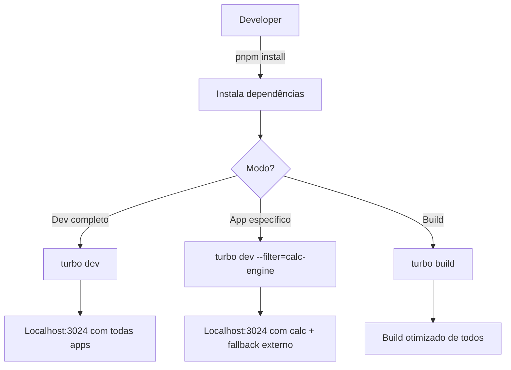

# Architecture

> Arquitetura do monorepo Turborepo com git submodules e pnpm

## 📐 Visão Geral

A arquitetura combina:
- **Turborepo** para orquestração de builds e tarefas
- **Git submodules** para manter repositórios independentes
- **pnpm** como package manager com workspaces
- **MFE proxy nativo** do Turborepo para desenvolvimento local

### Por que essa combinação?

| Aspecto | Solução | Benefício |
|---------|---------|-----------|
| Build independente | Git submodules | Cada app/lib tem seu próprio repo e ciclo de vida |
| Cache de builds | Turborepo | Builds incrementais e compartilhamento de cache |
| Dependências eficientes | pnpm | Content-addressable store economiza disco, sem phantom deps |
| Roteamento dev | Turborepo MFE proxy | Todas as apps em uma URL única no dev |

## 🏗️ Estrutura do Monorepo

```
turborepo-shell/
│
├── apps/                              # Aplicações front-end (Next.js ou Vite)
│   ├── portal/                        # 🔵 App shell principal (fallback) - Next.js
│   │   ├── .git → submodule          # Git submodule apontando para repo separado
│   │   ├── app/
│   │   ├── microfrontends.json        # ⭐ Configuração de routing MFE
│   │   ├── next.config.ts             # basePath: "" (é a raiz)
│   │   └── package.json
│   │
│   ├── calc-engine/                   # 🟢 MFE Calculadora - Next.js
│   │   ├── .git → submodule
│   │   ├── app/
│   │   ├── next.config.ts             # basePath: "/calc"
│   │   └── package.json
│   │
│   ├── dashboard/                     # 🟡 MFE Dashboard - Vite + React
│   │   ├── .git → submodule
│   │   ├── src/
│   │   ├── vite.config.ts             # base: "/dashboard"
│   │   └── package.json
│   │
│   └── settings/                      # 🟣 MFE Settings - Next.js
│       ├── .git → submodule
│       └── ...
│
├── packages/                          # Bibliotecas compartilhadas
│   ├── shared-auth/                   # 🔐 Autenticação unificada
│   │   ├── .git → submodule
│   │   ├── src/
│   │   │   ├── authStore.ts           # Zustand store
│   │   │   ├── useAuthBootstrap.ts    # Hook de inicialização
│   │   │   └── index.ts
│   │   └── package.json               # "@company/shared-auth"
│   │
│   ├── design-system/                 # 🎨 Design System
│   │   ├── .git → submodule
│   │   └── package.json               # "@company/design-system"
│   │
│   ├── design-blocks/                 # 🧱 Componentes
│   │   ├── .git → submodule
│   │   └── package.json               # "@company/design-blocks"
│   │
│   └── sdk/                           # 🛠️ SDK/Utils
│       ├── .git → submodule
│       └── package.json               # "@company/sdk"
│
├── .gitmodules                        # Configuração dos submodules
├── turbo.json                         # Configuração de pipelines do Turborepo
├── package.json                       # Root package.json
├── pnpm-workspace.yaml                # Definição de workspaces
└── .npmrc                             # Configurações do pnpm
```

## 🔗 Git Submodules

### Por que submodules?

- **Repositórios independentes**: Cada app/lib mantém seu próprio histórico Git
- **Deploys separados**: Cada time pode fazer deploy do seu MFE independentemente
- **Resiliência**: Falha em um MFE não afeta o build dos outros
- **Ownership**: Times diferentes podem ter ownership de diferentes MFEs

### Estrutura de repos

```
github.com/company/
├── turborepo-shell          # Este repo (orquestrador)
├── portal                   # Submodule em apps/portal/
├── calc-engine              # Submodule em apps/calc-engine/
├── dashboard                # Submodule em apps/dashboard/
├── settings                 # Submodule em apps/settings/
├── shared-auth              # Submodule em packages/shared-auth/
├── design-system            # Submodule em packages/design-system/
├── design-blocks            # Submodule em packages/design-blocks/
└── sdk                      # Submodule em packages/sdk/
```

### Setup de submodules

```bash
# Adicionar um novo MFE como submodule
git submodule add git@github.com:company/calc-engine.git apps/calc-engine

# Adicionar uma lib como submodule
git submodule add git@github.com:company/shared-auth.git packages/shared-auth

# Clonar o turborepo-shell com todos os submodules
git clone --recurse-submodules git@github.com:company/turborepo-shell.git

# Ou se já clonou sem --recurse-submodules
git submodule update --init --recursive
```

### Workflow com submodules

```bash
# Atualizar todos os submodules para o commit mais recente de suas branches
git submodule update --remote --merge

# Fazer mudanças em um submodule
cd apps/calc-engine
git checkout main
# ... faça suas mudanças ...
git add . && git commit -m "feat: nova feature"
git push origin main

# Voltar ao repo raiz e commitar a referência atualizada
cd ../..
git add apps/calc-engine
git commit -m "chore: update calc-engine submodule"
git push
```

## 📦 pnpm Workspaces

### Por que pnpm?

| Vantagem | Descrição |
|----------|-----------|
| **Content-addressable store** | Packages são armazenados uma única vez globalmente em `~/.pnpm-store`, economizando disco |
| **Strict node_modules** | Usa symlinks, eliminando phantom dependencies |
| **Performance** | Instalações muito mais rápidas que npm/yarn classic |
| **workspace:\* protocol** | Suporte nativo para referenciar workspaces locais |
| **Turborepo oficial** | Recomendado pela própria documentação do Turborepo |

### Configuração

**pnpm-workspace.yaml**
```yaml
packages:
  - 'apps/*'
  - 'packages/*'
```

**Root package.json**
```json
{
  "name": "turborepo-shell",
  "private": true,
  "scripts": {
    "dev": "turbo dev",
    "build": "turbo build",
    "lint": "turbo lint",
    "test": "turbo test"
  },
  "devDependencies": {
    "turbo": "^2.0.0"
  },
  "engines": {
    "node": ">=18.0.0",
    "pnpm": ">=8.0.0"
  },
  "packageManager": "pnpm@8.15.0"
}
```

**.npmrc**
```ini
# Strict peer dependencies
strict-peer-dependencies=false

# No hoisting (segurança contra phantom deps)
shamefully-hoist=false

# Shared workspace lockfile
shared-workspace-lockfile=true
```

### Como funciona o workspace

Quando você instala as dependências:

```bash
pnpm install
```

O pnpm:
1. Lê `pnpm-workspace.yaml` e identifica todos os workspaces
2. Resolve todas as dependências de todos os packages
3. Cria um único `pnpm-lock.yaml` no root
4. Instala os pacotes no content-addressable store global
5. Cria symlinks em cada `node_modules/` apontando para o store
6. Para dependências `workspace:*`, cria symlinks direto para a pasta local

**Exemplo prático:**

```
apps/calc-engine/package.json:
{
  "dependencies": {
    "@company/shared-auth": "workspace:*"
  }
}

Resultado em apps/calc-engine/node_modules/:
@company/
  shared-auth/ → symlink para ../../packages/shared-auth/
```

## ⚙️ Turborepo Configuration

**turbo.json**
```json
{
  "$schema": "https://turbo.build/schema.json",
  "tasks": {
    "build": {
      "dependsOn": ["^build"],
      "outputs": [".next/**", "!.next/cache/**", "dist/**"]
    },
    "dev": {
      "cache": false,
      "persistent": true
    },
    "lint": {
      "dependsOn": ["^lint"]
    },
    "test": {
      "dependsOn": ["^build"],
      "outputs": ["coverage/**"]
    }
  }
}
```

### Pipelines

- **build**: Builda todas as apps/packages. O `^build` significa "builda dependências primeiro"
- **dev**: Roda modo desenvolvimento. `persistent: true` mantém o processo rodando
- **lint**: Executa linting
- **test**: Executa testes

### Remote Caching (opcional)

O Turborepo suporta cache remoto para compartilhar builds entre times:

```bash
# Login no Vercel (provedor de cache oficial)
npx turbo login

# Link ao projeto
npx turbo link
```

Agora os builds são compartilhados entre devs e CI/CD!

## 🔄 Dev vs Prod vs Standalone

### Development (Turborepo proxy)

```bash
turbo dev
```

- Todas as apps rodam em **localhost:3024**
- Proxy do Turborepo roteia por path patterns
- HMR funciona em todas as apps
- Auth compartilhado via localStorage

### Production (Portal unificado)

- Todas as apps deployadas juntas ou separadas
- Reverse proxy (nginx/CloudFront/Vercel) roteia por path
- Domínio único: `portal.domain.com`
- Auth compartilhado via cookie + localStorage

### Standalone

- Cada app roda em seu próprio domínio/subdomínio
- `calc.domain.com`, `dashboard.domain.com`
- Libs instaladas via npm (versões publicadas)
- Exchange token para cross-subdomain auth

## 🎯 Fluxo de Desenvolvimento



## 📊 Comparação: Monorepo vs Polyrepo

| Aspecto | Nossa solução (Monorepo + Submodules) | Polyrepo puro |
|---------|---------------------------------------|---------------|
| DX local | ⭐⭐⭐⭐⭐ Excelente | ⭐⭐ Precisa rodar N repos |
| Build cache | ⭐⭐⭐⭐⭐ Turborepo cache | ⭐ Sem cache compartilhado |
| Versionamento libs | ⭐⭐⭐⭐ workspace:* + npm fallback | ⭐⭐⭐⭐⭐ Versões explícitas |
| Independência | ⭐⭐⭐⭐ Submodules independentes | ⭐⭐⭐⭐⭐ Total independência |
| Onboarding | ⭐⭐⭐ Clone único com submodules | ⭐⭐ Clone N repos |
| CI/CD | ⭐⭐⭐⭐ Pipeline único ou por app | ⭐⭐⭐ Pipeline por repo |

---

**Próximo**: [Routing](02-routing.md) - Como configurar o roteamento entre MFEs
