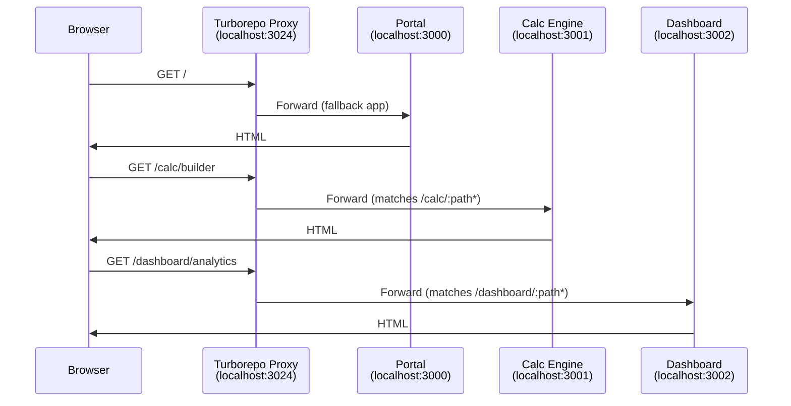

# Routing

> Configuração de roteamento entre Microfrontends usando Turborepo proxy

## 🎯 Visão Geral

O Turborepo oferece um **proxy server integrado** que permite rodar múltiplos MFEs simultaneamente em uma única URL durante o desenvolvimento. Em produção, o mesmo mapeamento de rotas é replicado via reverse proxy.

## 🔧 Configuração do microfrontends.json

O arquivo `microfrontends.json` é criado **no app principal** (geralmente `apps/portal/`) e define como as rotas são mapeadas para cada MFE.

### Localização

```
apps/portal/microfrontends.json
```

Este é o app "parent" que será o **fallback** (app padrão que captura todas as rotas não mapeadas).

### Estrutura Completa

```json
{
  "$schema": "https://turborepo.dev/microfrontends/schema.json",
  "applications": {
    "portal": {
      "development": {
        "local": { "port": 3000 },
        "fallback": "https://portal-staging.domain.com"
      }
    },
    "calc-engine": {
      "packageName": "calc-engine",
      "development": {
        "local": { "port": 3001 },
        "fallback": "https://calc-staging.domain.com"
      },
      "routing": [
        {
          "group": "calculator",
          "paths": [
            "/calc",
            "/calc/:path*",
            "/builder",
            "/builder/:path*",
            "/engines",
            "/engines/:path*"
          ]
        }
      ]
    },
    "dashboard": {
      "packageName": "dashboard",
      "development": {
        "local": { "port": 3002 },
        "fallback": "https://dashboard-staging.domain.com"
      },
      "routing": [
        {
          "group": "analytics",
          "paths": ["/dashboard", "/dashboard/:path*", "/analytics", "/analytics/:path*"]
        }
      ]
    },
    "settings": {
      "packageName": "settings",
      "development": {
        "local": { "port": 3003 },
        "fallback": "https://settings-staging.domain.com"
      },
      "routing": [
        {
          "group": "settings",
          "paths": ["/settings", "/settings/:path*"]
        }
      ]
    }
  },
  "options": {
    "localProxyPort": 3024
  }
}
```

## 📝 Propriedades

### Por Aplicação

| Propriedade | Descrição | Obrigatório |
|-------------|-----------|-------------|
| `packageName` | Nome do package no `package.json` | Não (usa a key se omitido) |
| `development.local.port` | Porta onde a app roda localmente | Sim |
| `development.fallback` | URL externa para quando app não roda localmente | Não |
| `routing` | Array de grupos de paths | Não (apenas uma app pode não ter) |

### Routing Patterns

O array `paths` suporta vários padrões:

#### 1. Exact Match (paths exatos)
```json
"paths": ["/pricing", "/about", "/contact"]
```
Apenas essas URLs exatas são roteadas para o MFE.

#### 2. Parameters (com parâmetros)
```json
"paths": ["/blog/:slug", "/users/:id/profile"]
```
- `/blog/hello-world` ✅ match
- `/blog/` ❌ não match
- `/users/123/profile` ✅ match

#### 3. Wildcards

**Asterisco `*` (zero ou mais segmentos):**
```json
"paths": ["/docs/:path*"]
```
- `/docs` ✅ match (zero segmentos)
- `/docs/intro` ✅ match
- `/docs/api/reference` ✅ match

**Plus `+` (um ou mais segmentos):**
```json
"paths": ["/api/:path+"]
```
- `/api` ❌ não match
- `/api/users` ✅ match
- `/api/users/123` ✅ match

#### 4. Complex Patterns
```json
"paths": [
  "/api/:version/users",
  "/api/:version/users/:id",
  "/api/:version/posts/:postId/comments/:commentId"
]
```

## ⚙️ Configuração de Portas

### Método Recomendado: `turbo get-mfe-port`

No `package.json` de cada MFE:

**Next.js:**
```json
{
  "name": "calc-engine",
  "scripts": {
    "dev": "next dev --port $(turbo get-mfe-port)"
  }
}
```

**Vite:**
```json
{
  "name": "dashboard",
  "scripts": {
    "dev": "vite --port $(turbo get-mfe-port)"
  }
}
```

O comando `turbo get-mfe-port` injeta automaticamente a porta definida no `microfrontends.json` quando você roda `turbo dev`.

### Alternativa: Variável de Ambiente

```json
{
  "scripts": {
    "dev": "next dev --port ${PORT:-3001}"
  }
}
```

## 🌐 Base Path Configuration (Prefixo de Rotas)

### O que é basePath?

O `basePath` é um **prefixo automático** para todas as rotas da sua aplicação. Quando você configura `basePath: "/calc"`, todas as rotas do app automaticamente têm `/calc/` como prefixo:

```
Rotas internas do app → Rotas públicas no portal
/                      → /calc/
/edit                  → /calc/edit
/builder               → /calc/builder
/engines/:id           → /calc/engines/:id
```

**Isso permite que cada MFE mantenha suas rotas simples internamente**, enquanto são servidas com prefixo no portal!

### Como funciona?

Cada MFE precisa configurar seu `basePath` para funcionar corretamente tanto no portal quanto standalone.

### Next.js

**apps/calc-engine/next.config.ts**
```typescript
import type { NextConfig } from 'next'

const basePath = process.env.BASE_PATH || ''

const nextConfig: NextConfig = {
  basePath,
  // Importante para assets
  assetPrefix: basePath || undefined,
}

export default nextConfig
```

**Uso:**
- **No portal (Turborepo)**: `BASE_PATH=/calc turbo dev`
- **Standalone**: `BASE_PATH= npm run dev` (vazio = raiz)

### Vite + React

**apps/dashboard/vite.config.ts**
```typescript
import { defineConfig } from 'vite'
import react from '@vitejs/plugin-react'

export default defineConfig({
  plugins: [react()],
  base: process.env.BASE_PATH || '/',
  server: {
    port: parseInt(process.env.PORT || '3002'),
  },
})
```

**Router configuration (React Router):**
```tsx
// apps/dashboard/src/main.tsx
import { BrowserRouter } from 'react-router-dom'

const basePath = import.meta.env.BASE_URL

function App() {
  return (
    <BrowserRouter basename={basePath}>
      {/* routes */}
    </BrowserRouter>
  )
}
```

### Exemplo Prático: Calc Engine (Next.js)

**Rotas internas no código (apps/calc-engine/app/):**
```
app/
├── page.tsx              # Rota: / (internamente)
├── edit/
│   └── page.tsx          # Rota: /edit (internamente)
├── builder/
│   └── page.tsx          # Rota: /builder (internamente)
└── engines/
    └── [id]/
        └── page.tsx      # Rota: /engines/:id (internamente)
```

**Com `basePath: "/calc"` configurado:**

| Código interno | URL no portal | URL standalone |
|---|---|---|
| `/` | `localhost:3024/calc` | `calc.domain.com/` |
| `/edit` | `localhost:3024/calc/edit` | `calc.domain.com/edit` |
| `/builder` | `localhost:3024/calc/builder` | `calc.domain.com/builder` |
| `/engines/123` | `localhost:3024/calc/engines/123` | `calc.domain.com/engines/123` |

**No código, você sempre usa paths internos:**
```tsx
// ✅ Correto - paths internos relativos
<Link href="/">Home do Calc</Link>
<Link href="/edit">Editar</Link>
<Link href="/builder">Builder</Link>

// O Next.js automaticamente adiciona o /calc/ quando renderiza!
// <a href="/calc/">Home do Calc</a>
// <a href="/calc/edit">Editar</a>
```

### Exemplo Prático: Dashboard (Vite + React Router)

**Rotas internas no código (apps/dashboard/src/):**
```tsx
// src/App.tsx
import { Routes, Route } from 'react-router-dom'

function App() {
  return (
    <Routes>
      <Route path="/" element={<Home />} />
      <Route path="/analytics" element={<Analytics />} />
      <Route path="/reports" element={<Reports />} />
      <Route path="/settings" element={<Settings />} />
    </Routes>
  )
}
```

**Com `base: "/dashboard"` configurado no vite.config.ts:**

| Código interno (Route path) | URL no portal | URL standalone |
|---|---|---|
| `/` | `localhost:3024/dashboard` | `dashboard.domain.com/` |
| `/analytics` | `localhost:3024/dashboard/analytics` | `dashboard.domain.com/analytics` |
| `/reports` | `localhost:3024/dashboard/reports` | `dashboard.domain.com/reports` |
| `/settings` | `localhost:3024/dashboard/settings` | `dashboard.domain.com/settings` |

**No código, você sempre usa paths internos:**
```tsx
import { Link } from 'react-router-dom'

// ✅ Correto - paths internos relativos
<Link to="/">Home do Dashboard</Link>
<Link to="/analytics">Analytics</Link>
<Link to="/reports">Relatórios</Link>

// O React Router + basename automaticamente adiciona /dashboard/ quando renderiza!
// <a href="/dashboard/">Home do Dashboard</a>
// <a href="/dashboard/analytics">Analytics</a>
```

**Configuração completa do Vite:**
```typescript
// apps/dashboard/vite.config.ts
import { defineConfig } from 'vite'
import react from '@vitejs/plugin-react'

export default defineConfig({
  plugins: [react()],
  base: process.env.BASE_PATH || '/',  // ← "/dashboard" no portal, "/" standalone
  server: {
    port: parseInt(process.env.PORT || '3002'),
  },
})
```

```tsx
// apps/dashboard/src/main.tsx
import { createRoot } from 'react-dom/client'
import { BrowserRouter } from 'react-router-dom'
import App from './App'

const basePath = import.meta.env.BASE_URL  // Lê o "base" do vite.config.ts

createRoot(document.getElementById('root')!).render(
  <BrowserRouter basename={basePath}>
    <App />
  </BrowserRouter>
)
```

**Variáveis de ambiente:**
```bash
# .env.local (no portal)
BASE_PATH=/dashboard

# .env.local (standalone)
BASE_PATH=/
```

### Navegação entre MFEs

Para navegar **entre** MFEs diferentes, use paths absolutos a partir da raiz do portal:

```tsx
// Navegando DE calc-engine PARA dashboard
<Link href="/dashboard/analytics">Ver Analytics</Link>

// Navegando DE dashboard PARA calc-engine
<Link href="/calc/builder">Abrir Calculadora</Link>
```

Ou use `window.location.href` para navegação cross-MFE:
```tsx
const goToDashboard = () => {
  window.location.href = '/dashboard/analytics'
}
```

## 🚀 Executando o Proxy

### Todas as aplicações

```bash
turbo dev
```

Quando você roda `turbo dev`, o Turborepo:
1. Inicia o **proxy server** na porta `3024` (ou a definida em `options.localProxyPort`)
2. Injeta a variável `TURBO_MFE_PORT` em cada task
3. Executa o `dev` script de todos os MFEs
4. Roteia requests baseado nos path patterns do `microfrontends.json`

Acesse: **http://localhost:3024**

### Aplicação específica com fallback

```bash
turbo dev --filter=calc-engine
```

Roda apenas o `calc-engine` localmente. Outras rotas vão para o `fallback` definido (staging/produção).

Exemplo:
- `localhost:3024/calc` → roda localmente ✅
- `localhost:3024/dashboard` → proxy para `https://dashboard-staging.domain.com` 🌐

## 📊 Fluxo de Roteamento (Dev)



## 🌍 Produção: Reverse Proxy

Em produção, você replica o mesmo mapeamento usando um reverse proxy.

### Nginx

```nginx
# Portal: portal.domain.com

upstream portal {
    server portal-app:3000;
}

upstream calc-engine {
    server calc-app:3001;
}

upstream dashboard {
    server dashboard-app:3002;
}

server {
    listen 80;
    server_name portal.domain.com;

    # Calc Engine MFE
    location ~ ^/calc(/.*)?$ {
        proxy_pass http://calc-engine;
        proxy_set_header Host $host;
        proxy_set_header X-Real-IP $remote_addr;
    }

    location ~ ^/builder(/.*)?$ {
        proxy_pass http://calc-engine;
        proxy_set_header Host $host;
        proxy_set_header X-Real-IP $remote_addr;
    }

    location ~ ^/engines(/.*)?$ {
        proxy_pass http://calc-engine;
        proxy_set_header Host $host;
        proxy_set_header X-Real-IP $remote_addr;
    }

    # Dashboard MFE
    location ~ ^/dashboard(/.*)?$ {
        proxy_pass http://dashboard;
        proxy_set_header Host $host;
        proxy_set_header X-Real-IP $remote_addr;
    }

    # Portal (fallback)
    location / {
        proxy_pass http://portal;
        proxy_set_header Host $host;
        proxy_set_header X-Real-IP $remote_addr;
    }
}
```

### Vercel

O Vercel tem suporte nativo via `@vercel/microfrontends`:

```bash
npm install @vercel/microfrontends
```

O mesmo `microfrontends.json` é usado! Consulte [documentação oficial](https://vercel.com/docs/concepts/microfrontends).

### CloudFront (AWS)

Use **Lambda@Edge** ou **CloudFront Functions** para rotear baseado no path:

```javascript
function handler(event) {
    const request = event.request;
    const uri = request.uri;

    // Calc Engine routes
    if (uri.startsWith('/calc') || uri.startsWith('/builder') || uri.startsWith('/engines')) {
        request.origin = {
            custom: {
                domainName: 'calc-engine.domain.com',
                port: 443,
                protocol: 'https',
            }
        };
        return request;
    }

    // Dashboard routes
    if (uri.startsWith('/dashboard')) {
        request.origin = {
            custom: {
                domainName: 'dashboard.domain.com',
                port: 443,
                protocol: 'https',
            }
        };
        return request;
    }

    // Fallback to portal
    request.origin = {
        custom: {
            domainName: 'portal.domain.com',
            port: 443,
            protocol: 'https',
        }
    };
    return request;
}
```

## 🔀 Navegação Entre MFEs

### Links internos

Use paths absolutos a partir da raiz do portal:

```tsx
// ✅ Correto - path absoluto
<Link href="/dashboard/analytics">Ver Analytics</Link>
<Link href="/calc/builder">Abrir Builder</Link>

// ❌ Errado - paths relativos podem quebrar
<Link href="../dashboard/analytics">Ver Analytics</Link>
```

### Programaticamente (Next.js)

```tsx
import { useRouter } from 'next/navigation'

function MyComponent() {
  const router = useRouter()

  const goToDashboard = () => {
    router.push('/dashboard/analytics')
  }

  return <button onClick={goToDashboard}>Dashboard</button>
}
```

### Programaticamente (Vite + React Router)

```tsx
import { useNavigate } from 'react-router-dom'

function MyComponent() {
  const navigate = useNavigate()

  const goToCalc = () => {
    navigate('/calc/builder')
  }

  return <button onClick={goToCalc}>Calculator</button>
}
```

## 🎨 Group Labels

O campo `group` é **apenas organizacional** e não afeta o roteamento:

```json
"routing": [
  {
    "group": "calculator",  // ← Apenas para documentação
    "paths": ["/calc", "/calc/:path*"]
  },
  {
    "group": "admin",
    "paths": ["/engines", "/engines/:path*"]
  }
]
```

Útil para organizar visualmente rotas relacionadas em MFEs grandes.

## ⚠️ Troubleshooting

### Porta já em uso

```
Error: Port 3024 is already in use
```

**Solução 1**: Mude a porta no `microfrontends.json`:
```json
"options": {
  "localProxyPort": 3025
}
```

**Solução 2**: Mate o processo na porta:
```bash
lsof -ti:3024 | xargs kill -9
```

### App não responde

```
Timeout waiting for calc-engine to start
```

**Possíveis causas**:
1. App não está escutando na porta correta → verifique o `dev` script
2. App crashou → cheque os logs do terminal
3. Firewall bloqueando → desabilite temporariamente

### HMR não funciona

O Turborepo proxy suporta WebSocket para HMR. Certifique-se que:
- Next.js: HMR funciona out-of-the-box
- Vite: Configure `server.hmr` se necessário:

```ts
// vite.config.ts
export default defineConfig({
  server: {
    hmr: {
      protocol: 'ws',
      host: 'localhost',
    },
  },
})
```

---

**Próximo**: [Shared Auth](03-shared-auth.md) - Sistema de autenticação unificado
