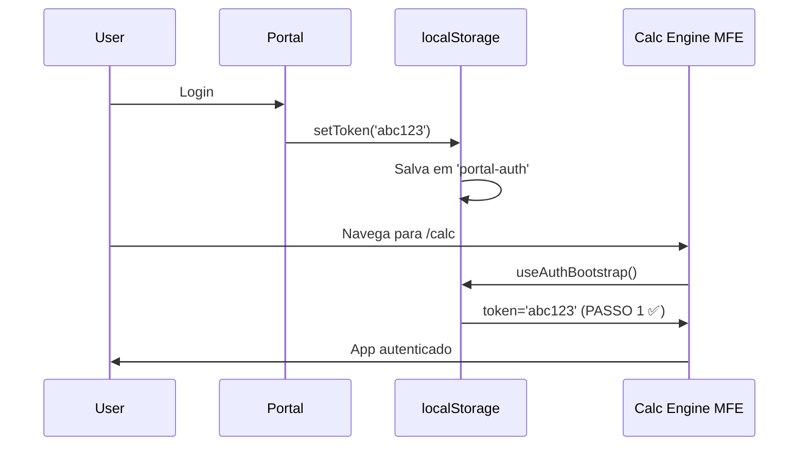
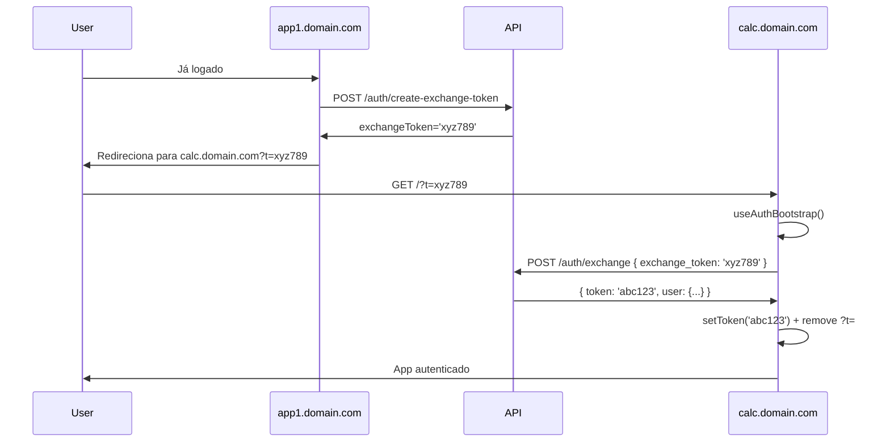
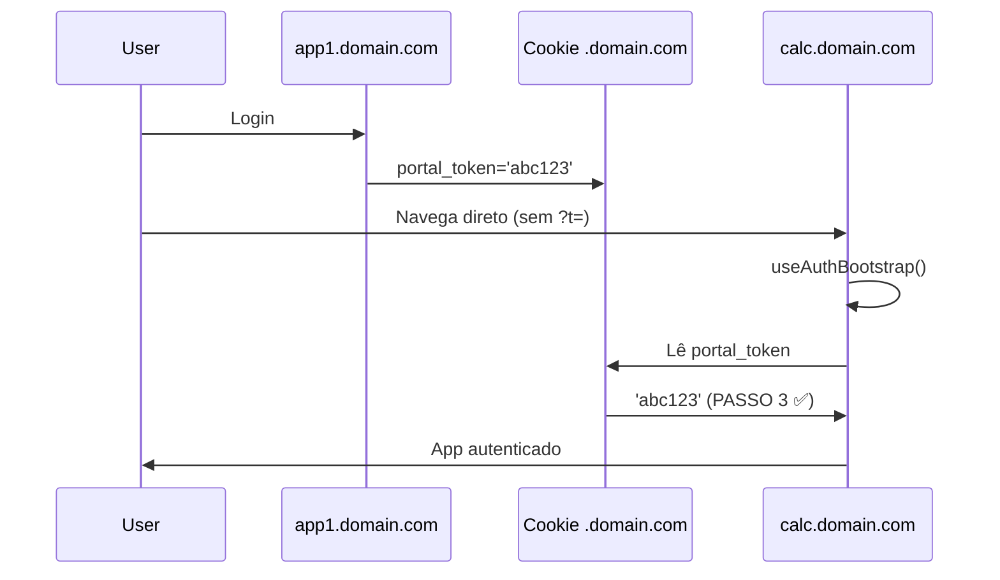
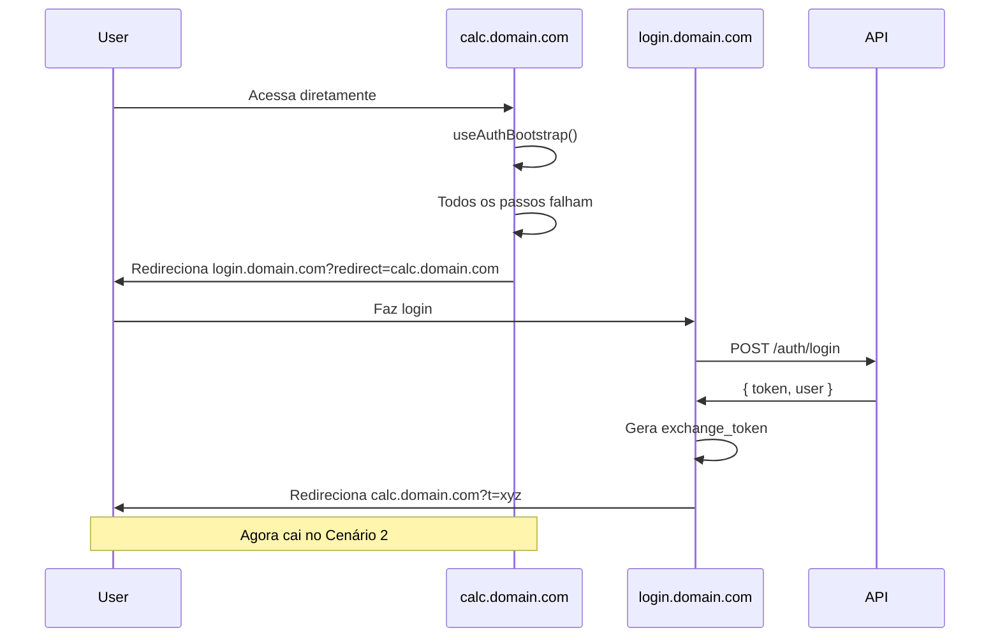

# Shared Auth

> Sistema de autenticação unificado para Microfrontends

## 🎯 Visão Geral

O pacote `@company/shared-auth` fornece autenticação unificada que funciona em **todos os cenários**:

- ✅ **Turborepo (dev/prod)**: localStorage compartilhado automaticamente
- ✅ **Standalone cross-subdomain**: Exchange tokens + cookies `.domain.com`
- ✅ **SSO flow**: Redirect para login centralizado

## 🏗️ Arquitetura

```
packages/shared-auth/
├── src/
│   ├── authStore.ts              # Zustand store com persist
│   ├── useAuthBootstrap.ts       # Hook de inicialização (first load)
│   ├── types.ts                  # TypeScript types
│   └── index.ts                  # Exports públicos
├── package.json
└── tsconfig.json
```

## 📦 AuthStore (Zustand)

O store central de autenticação usa Zustand com middleware `persist`:

**packages/shared-auth/src/authStore.ts**
```typescript
import { create } from 'zustand'
import { persist } from 'zustand/middleware'

interface AuthState {
  token: string | null
  user: User | null
  setToken: (token: string | null) => void
  setUser: (user: User | null) => void
  logout: () => void
  getAuthHeaders: () => Record<string, string>
}

interface User {
  id: string
  name: string
  email: string
}

export const useAuthStore = create<AuthState>()(
  persist(
    (set, get) => ({
      token: null,
      user: null,

      setToken: (token) => {
        set({ token })
        
        // TAMBÉM salva cookie para cross-subdomain
        if (token) {
          document.cookie = `portal_token=${encodeURIComponent(token)}; domain=.domain.com; path=/; max-age=86400; SameSite=Lax; Secure`
        } else {
          // Remove cookie
          document.cookie = `portal_token=; domain=.domain.com; path=/; max-age=0`
        }
      },

      setUser: (user) => set({ user }),

      logout: () => {
        set({ token: null, user: null })
        // Remove cookie
        document.cookie = `portal_token=; domain=.domain.com; path=/; max-age=0`
        // Remove localStorage (já feito automaticamente pelo persist)
      },

      getAuthHeaders: () => {
        const t = get().token
        return t ? { Authorization: `Bearer ${t}` } : {}
      },
    }),
    {
      name: 'portal-auth', // ⭐ Mesma key em TODOS os MFEs
      partialize: (state) => ({
        token: state.token,
        user: state.user,
      }),
    }
  )
)
```

### Pontos importantes:

1. **localStorage key `'portal-auth'`**: Todos os MFEs usam a mesma key, então o token é compartilhado automaticamente quando no mesmo domínio
2. **Cookie `.domain.com`**: Salvo também como cookie para cross-subdomain scenarios
3. **`getAuthHeaders()`**: Helper para adicionar headers em requests

## 🚀 useAuthBootstrap Hook

Este hook é **executado no first load** de cada MFE e resolve a autenticação com fallbacks em cascata.

**packages/shared-auth/src/useAuthBootstrap.ts**
```typescript
import { useEffect, useState } from 'react'
import { useAuthStore } from './authStore'

interface AuthBootstrapOptions {
  loginUrl: string // ex: "https://login.domain.com"
  exchangeTokenFn: (exchangeToken: string) => Promise<{ token: string; user: User }>
  onAuthenticated?: (token: string) => void
  onUnauthenticated?: () => void
}

export function useAuthBootstrap(options: AuthBootstrapOptions) {
  const { token, setToken, setUser } = useAuthStore()
  const [isInitialized, setIsInitialized] = useState(false)
  const [isAuthenticated, setIsAuthenticated] = useState(false)

  useEffect(() => {
    async function bootstrap() {
      try {
        // ============================================
        // PASSO 1: Já tem token no localStorage?
        // ============================================
        if (token) {
          console.log('[Auth] Token found in localStorage')
          setIsAuthenticated(true)
          options.onAuthenticated?.(token)
          cleanUrlParams()
          setIsInitialized(true)
          return
        }

        // ============================================
        // PASSO 2: Tem exchange_token na URL?
        // ============================================
        const urlParams = new URLSearchParams(window.location.search)
        const exchangeToken = urlParams.get('t')

        if (exchangeToken) {
          console.log('[Auth] Exchange token found in URL')
          try {
            const { token: realToken, user } = await options.exchangeTokenFn(exchangeToken)
            setToken(realToken)
            setUser(user)
            setIsAuthenticated(true)
            cleanUrlParams()
            options.onAuthenticated?.(realToken)
            setIsInitialized(true)
            return
          } catch (error) {
            console.error('[Auth] Exchange token failed:', error)
            // Token inválido/expirado, continua para próximo passo
          }
        }

        // ============================================
        // PASSO 3: Tenta cookie compartilhado
        // ============================================
        const cookieToken = getCookieToken()
        if (cookieToken) {
          console.log('[Auth] Token found in cookie')
          setToken(cookieToken)
          setIsAuthenticated(true)
          options.onAuthenticated?.(cookieToken)
          setIsInitialized(true)
          return
        }

        // ============================================
        // PASSO 4: Sem auth nenhum → redireciona pro login
        // ============================================
        console.log('[Auth] No authentication found, redirecting to login')
        options.onUnauthenticated?.()
        redirectToLogin(options.loginUrl)
      } catch (error) {
        console.error('[Auth] Bootstrap error:', error)
        setIsInitialized(true)
      }
    }

    bootstrap()
  }, [])

  return { 
    isInitialized, 
    isAuthenticated,
    token 
  }
}

function cleanUrlParams() {
  const url = new URL(window.location.href)
  url.searchParams.delete('t')
  window.history.replaceState({}, '', url.toString())
}

function getCookieToken(): string | null {
  const match = document.cookie.match(/(?:^|;\s*)portal_token=([^;]*)/)
  return match ? decodeURIComponent(match[1]) : null
}

function redirectToLogin(loginUrl: string) {
  const returnUrl = encodeURIComponent(window.location.href)
  window.location.href = `${loginUrl}?redirect=${returnUrl}`
}
```

## 🔄 Fluxos de Autenticação

### Cenário 1: Turborepo (dev ou prod mesmo domínio)



**Não precisa de exchange_token!** O localStorage é compartilhado porque estão no mesmo domínio.

### Cenário 2: Standalone com exchange_token



**Backend precisa expor 2 endpoints:**
- `POST /auth/create-exchange-token` → gera token temporário (1min TTL)
- `POST /auth/exchange` → troca exchange_token por token real

### Cenário 3: Standalone com cookie



**Funciona porque o cookie é compartilhado em `.domain.com`**.

### Cenário 4: Sem auth → Login redirect



## 💻 Uso nos MFEs

### Setup no App Shell (Portal)

**apps/portal/app/layout.tsx** (Next.js)
```tsx
import { useAuthBootstrap } from '@company/shared-auth'
import { exchangeToken } from '@/lib/api'

export default function RootLayout({ children }) {
  const { isInitialized, isAuthenticated } = useAuthBootstrap({
    loginUrl: process.env.NEXT_PUBLIC_LOGIN_URL || 'https://login.domain.com',
    exchangeTokenFn: async (token) => {
      const res = await fetch('/api/auth/exchange', {
        method: 'POST',
        headers: { 'Content-Type': 'application/json' },
        body: JSON.stringify({ exchange_token: token }),
      })
      if (!res.ok) throw new Error('Exchange failed')
      return res.json()
    },
    onAuthenticated: (token) => {
      console.log('User authenticated:', token)
    },
  })

  if (!isInitialized) {
    return <LoadingSpinner />
  }

  if (!isAuthenticated) {
    return null // Will redirect to login
  }

  return (
    <html>
      <body>{children}</body>
    </html>
  )
}
```

### Setup em MFE Next.js

**apps/calc-engine/app/layout.tsx**
```tsx
import { useAuthBootstrap, useAuthStore } from '@company/shared-auth'

export default function CalcLayout({ children }) {
  const { isInitialized } = useAuthBootstrap({
    loginUrl: process.env.NEXT_PUBLIC_LOGIN_URL!,
    exchangeTokenFn: async (token) => {
      // Implementação do exchange
    },
  })

  const user = useAuthStore((state) => state.user)

  if (!isInitialized) return <div>Loading...</div>

  return (
    <div>
      <header>Bem-vindo, {user?.name}</header>
      {children}
    </div>
  )
}
```

### Setup em MFE Vite

**apps/dashboard/src/App.tsx**
```tsx
import { useEffect } from 'react'
import { useAuthBootstrap, useAuthStore } from '@company/shared-auth'

function App() {
  const { isInitialized, isAuthenticated } = useAuthBootstrap({
    loginUrl: import.meta.env.VITE_LOGIN_URL,
    exchangeTokenFn: async (token) => {
      const res = await fetch('/api/auth/exchange', {
        method: 'POST',
        body: JSON.stringify({ exchange_token: token }),
      })
      return res.json()
    },
  })

  if (!isInitialized) {
    return <div>Carregando...</div>
  }

  return <Dashboard />
}
```

## 🔒 Usando Auth em Requests

### Com fetch

```tsx
import { useAuthStore } from '@company/shared-auth'

function MyComponent() {
  const getAuthHeaders = useAuthStore((state) => state.getAuthHeaders)

  const fetchData = async () => {
    const res = await fetch('/api/data', {
      headers: {
        ...getAuthHeaders(),
        'Content-Type': 'application/json',
      },
    })
    return res.json()
  }
}
```

### Com Axios

```tsx
import axios from 'axios'
import { useAuthStore } from '@company/shared-auth'

const api = axios.create({
  baseURL: '/api',
})

// Interceptor para adicionar token automaticamente
api.interceptors.request.use((config) => {
  const token = useAuthStore.getState().token
  if (token) {
    config.headers.Authorization = `Bearer ${token}`
  }
  return config
})

export default api
```

## 🚪 Logout

```tsx
import { useAuthStore } from '@company/shared-auth'

function LogoutButton() {
  const logout = useAuthStore((state) => state.logout)

  const handleLogout = () => {
    logout() // Remove token do localStorage + cookie
    window.location.href = '/login'
  }

  return <button onClick={handleLogout}>Sair</button>
}
```

## ⚙️ Backend: Exchange Token Endpoint

Exemplo de implementação no backend:

```typescript
// POST /api/auth/create-exchange-token
export async function createExchangeToken(req, res) {
  const { token } = req.body // Token atual do usuário

  // Valida token atual
  const user = await validateToken(token)
  if (!user) return res.status(401).json({ error: 'Invalid token' })

  // Gera exchange_token temporário (1 minuto de validade)
  const exchangeToken = generateRandomToken()
  await redis.setex(`exchange:${exchangeToken}`, 60, user.id)

  res.json({ exchange_token: exchangeToken })
}

// POST /api/auth/exchange
export async function exchange(req, res) {
  const { exchange_token } = req.body

  // Valida e consome exchange_token (só pode ser usado uma vez)
  const userId = await redis.get(`exchange:${exchange_token}`)
  if (!userId) {
    return res.status(401).json({ error: 'Invalid or expired exchange token' })
  }

  await redis.del(`exchange:${exchange_token}`) // Consome

  // Gera token real
  const user = await getUserById(userId)
  const token = generateJWT(user)

  res.json({ token, user })
}
```

## 🔐 Segurança

### Exchange Tokens

- **TTL curto**: 1 minuto de validade
- **Single-use**: Consumido após primeira troca
- **Não expõe dados sensíveis**: É apenas um ID temporário

### Cookies

```typescript
// Flags de segurança
document.cookie = `portal_token=${token}; domain=.domain.com; path=/; max-age=86400; SameSite=Lax; Secure; HttpOnly`
```

- `Secure`: Apenas HTTPS
- `HttpOnly`: Não acessível via JavaScript (previne XSS)
- `SameSite=Lax`: Proteção contra CSRF

⚠️ **Nota**: Se usar `HttpOnly`, o cookie não será acessível pelo `useAuthBootstrap` no frontend. Nesse caso, use apenas cookies e faça validação server-side.

---

**Próximo**: [Shared Libraries](04-shared-libraries.md) - Gestão de dependências compartilhadas
