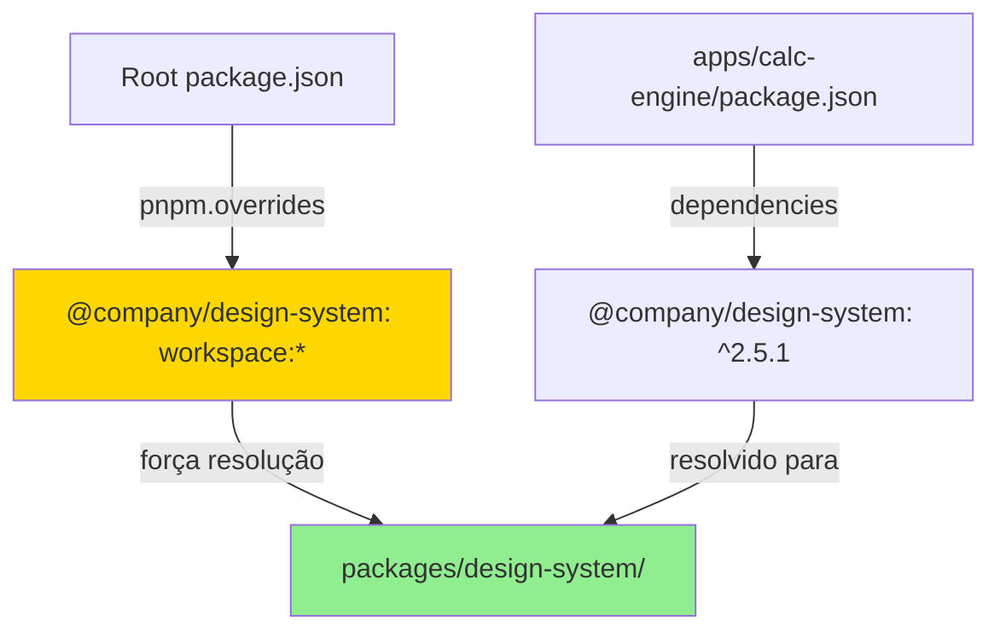

# Shared Libraries

> Gestão de dependências compartilhadas entre Turborepo e standalone

## 🎯 O Desafio

Queremos que as libs compartilhadas (design-system, sdk, etc.) funcionem em **dois cenários**:

1. **No Turborepo**: Referência direta ao código local via `workspace:*`
2. **Standalone**: Instalação via npm/pnpm da versão publicada

Isso permite:
- 🚀 **Dev rápido** no monorepo (mudanças refletem instantaneamente)
- 📦 **Autonomia** dos MFEs standalone (usam versões estáveis publicadas)
- 🔄 **Versionamento explícito** quando necessário

## 🏗️ Estrutura das Libs

```
packages/
├── shared-auth/                   # Autenticação
│   ├── src/
│   ├── package.json              # "@company/shared-auth": "^1.2.0"
│   └── .git → submodule
│
├── design-system/                 # Components UI
│   ├── src/
│   ├── package.json              # "@company/design-system": "^2.5.1"
│   └── .git → submodule
│
├── design-blocks/                 # Componentes complexos
│   ├── src/
│   ├── package.json              # "@company/design-blocks": "^1.8.0"
│   └── .git → submodule
│
├── sdk/                           # Utils/helpers
│   ├── src/
│   ├── package.json              # "@company/sdk": "^3.1.0"
│   └── .git → submodule
│
└── helptils/                      # Helpers & Utils gerais
    ├── src/
    ├── package.json              # "@company/helptils": "^1.0.5"
    └── .git → submodule
```

## 📦 Package.json das Libs

Cada lib tem seu próprio `package.json` com versionamento semver:

**packages/design-system/package.json**
```json
{
  "name": "@company/design-system",
  "version": "2.5.1",
  "main": "./dist/index.js",
  "types": "./dist/index.d.ts",
  "files": ["dist"],
  "scripts": {
    "build": "tsup src/index.ts --dts --format esm,cjs",
    "dev": "tsup src/index.ts --dts --format esm,cjs --watch",
    "lint": "eslint src/",
    "test": "vitest"
  },
  "peerDependencies": {
    "react": "^18.0.0",
    "react-dom": "^18.0.0"
  },
  "devDependencies": {
    "@types/react": "^18.2.0",
    "tsup": "^8.0.0",
    "typescript": "^5.3.0",
    "vitest": "^1.0.0"
  },
  "publishConfig": {
    "access": "public",
    "registry": "https://registry.npmjs.org/"
  }
}
```

### Pontos importantes:

- **`name`**: Scoped package (`@company/...`)
- **`version`**: Segue semver (major.minor.patch)
- **`main`** e **`types`**: Aponta para os arquivos buildados em `dist/`
- **`files`**: Apenas o `dist/` é publicado (não publica `src/`)
- **`peerDependencies`**: React é peer (não bundled)

## 🔗 Referência no Turborepo (workspace:*)

### No package.json dos MFEs (dentro do monorepo)

**apps/calc-engine/package.json**
```json
{
  "name": "calc-engine",
  "version": "1.0.0",
  "dependencies": {
    "@company/shared-auth": "^1.2.0",
    "@company/design-system": "^2.5.1",
    "@company/design-blocks": "^1.8.0",
    "@company/sdk": "^3.1.0",
    "@company/helptils": "^1.0.5",
    "next": "^14.0.0",
    "react": "^18.2.0",
    "zustand": "^4.4.0"
  }
}
```

⚠️ **Note que as versões são as PUBLICADAS** (`^1.2.0`, não `workspace:*`)

### pnpm.overrides no root

Aqui está a mágica! No **root `package.json`**, forçamos o uso do workspace:

**package.json** (root do turborepo)
```json
{
  "name": "turborepo-shell",
  "private": true,
  "pnpm": {
    "overrides": {
      "@company/shared-auth": "workspace:*",
      "@company/design-system": "workspace:*",
      "@company/design-blocks": "workspace:*",
      "@company/sdk": "workspace:*",
      "@company/helptils": "workspace:*"
    }
  },
  "scripts": {
    "dev": "turbo dev",
    "build": "turbo build"
  },
  "devDependencies": {
    "turbo": "^2.0.0"
  },
  "engines": {
    "node": ">=18.0.0",
    "pnpm": ">=8.0.0",
    "npm": "use-pnpm-please",
    "yarn": "use-pnpm-please"
  },
  "packageManager": "pnpm@8.15.0"
}
```

### Como funciona?



Quando você roda `pnpm install` no monorepo:
1. pnpm lê `apps/calc-engine/package.json` e vê `"@company/design-system": "^2.5.1"`
2. Antes de instalar do npm, checa os `overrides` no root
3. Encontra `"@company/design-system": "workspace:*"`
4. **Força a resolução** para `packages/design-system/` local
5. Cria symlink em `apps/calc-engine/node_modules/@company/design-system` → `../../packages/design-system`

**Resultado**: No monorepo, sempre usa o código local. Standalone, usa a versão npm.

## 🔧 Forçando uso do pnpm

### engines + scripts personalizados

No **root package.json**:

```json
{
  "engines": {
    "node": ">=18.0.0",
    "pnpm": ">=8.0.0",
    "npm": "use-pnpm-please",
    "yarn": "use-pnpm-please"
  },
  "packageManager": "pnpm@8.15.0"
}
```

Se alguém tentar `npm install` ou `yarn install`:
```
npm ERR! Unsupported engine for turborepo-shell@1.0.0: wanted: {"npm":"use-pnpm-please"} (current: {"npm":"10.2.3"})
```

### Preinstall hook (alternativa mais amigável)

**package.json** (root):
```json
{
  "scripts": {
    "preinstall": "node scripts/check-package-manager.js",
    "dev": "turbo dev"
  }
}
```

**scripts/check-package-manager.js**:
```javascript
#!/usr/bin/env node

// Detecta qual package manager está sendo usado
const userAgent = process.env.npm_config_user_agent || ''

if (!userAgent.includes('pnpm')) {
  console.error('\n❌ Este projeto usa pnpm como package manager.\n')
  console.error('Por favor, instale pnpm globalmente:')
  console.error('  npm install -g pnpm\n')
  console.error('E então rode:')
  console.error('  pnpm install\n')
  process.exit(1)
}

console.log('✅ Usando pnpm corretamente!\n')
```

Agora, se alguém rodar `npm install`:
```
> preinstall
> node scripts/check-package-manager.js

❌ Este projeto usa pnpm como package manager.

Por favor, instale pnpm globalmente:
  npm install -g pnpm

E então rode:
  pnpm install
```

## 📤 Publicando as Libs

### 1. Build da lib

```bash
cd packages/design-system
pnpm build
```

Isso gera o `dist/` com arquivos transpilados.

### 2. Bump version

```bash
npm version patch  # 1.0.0 → 1.0.1
npm version minor  # 1.0.1 → 1.1.0
npm version major  # 1.1.0 → 2.0.0
```

### 3. Publish

```bash
npm publish

# Ou se estiver usando um registry privado
npm publish --registry https://npm.company.com
```

### 4. Atualizar refs no monorepo (opcional)

Se quiser que os MFEs apontem para a nova versão publicada (mesmo no monorepo):

**apps/calc-engine/package.json**
```json
{
  "dependencies": {
    "@company/design-system": "^2.6.0"  // ← atualiza aqui
  }
}
```

Mas lembre: o `pnpm.overrides` ainda vai forçar o uso do workspace local. Isso é apenas para documentar a versão "oficial" que o standalone deve usar.

## 🔄 Workflow: Mudando uma Lib

### Cenário: Adicionar novo componente no design-system

#### No monorepo (dev rápido)

```bash
# 1. Desenvolva
cd packages/design-system
# ... edita src/Button.tsx ...

# 2. Testa em um MFE
cd ../../apps/calc-engine
# Import já funciona instantaneamente! (graças ao symlink)
import { Button } from '@company/design-system'

# 3. Builda tudo
cd ../..
turbo build
```

**Não precisa publicar nada!** As mudanças são refletidas instantaneamente via symlink.

#### Publicar para standalone

```bash
# 1. Builda a lib
cd packages/design-system
pnpm build

# 2. Testa
pnpm test

# 3. Bump version
npm version minor  # 2.5.1 → 2.6.0

# 4. Commita
git add .
git commit -m "feat: add new Button variant"
git push

# 5. Publica
npm publish

# 6. Atualiza referência no monorepo (opcional)
cd ../..
# Edita apps/*/package.json para apontar para ^2.6.0
pnpm install

# 7. Commita submodule ref
git add packages/design-system
git commit -m "chore: bump design-system to 2.6.0"
git push
```

## 🎨 Exemplo: Helptils

**packages/helptils/package.json**
```json
{
  "name": "@company/helptils",
  "version": "1.0.5",
  "description": "Helpers & utilities for all apps",
  "main": "./dist/index.js",
  "types": "./dist/index.d.ts",
  "files": ["dist"],
  "scripts": {
    "build": "tsup src/index.ts --dts --format esm,cjs",
    "dev": "tsup src/index.ts --dts --format esm,cjs --watch",
    "test": "vitest"
  },
  "devDependencies": {
    "tsup": "^8.0.0",
    "typescript": "^5.3.0",
    "vitest": "^1.0.0"
  }
}
```

**packages/helptils/src/index.ts**
```typescript
// Date helpers
export { formatDate, parseDate, addDays } from './date'

// String helpers
export { capitalize, slugify, truncate } from './string'

// Number helpers
export { formatCurrency, formatPercent, clamp } from './number'

// Object helpers
export { omit, pick, deepMerge } from './object'

// Array helpers
export { chunk, groupBy, unique } from './array'
```

**Uso nos MFEs:**
```tsx
import { formatCurrency, capitalize } from '@company/helptils'

const value = formatCurrency(1234.56) // "R$ 1.234,56"
const name = capitalize('joão') // "João"
```

## 📊 Comparação: workspace vs npm published

| Aspecto | Turborepo (workspace) | Standalone (npm) |
|---------|----------------------|------------------|
| **Resolução** | `packages/design-system/` local | Registry npm |
| **Mudanças** | Instantâneas (symlink) | Precisa publicar + reinstalar |
| **Versionamento** | Ignorado (sempre @latest local) | Respeitado (^2.5.1) |
| **Build** | Pode usar fonte direta | Precisa buildar antes de publicar |
| **Testing** | Testa mudanças não commitadas | Testa versão publicada |
| **DX** | ⭐⭐⭐⭐⭐ Excelente | ⭐⭐⭐ Bom |

## ⚙️ tsconfig paths (alternativa)

Se você não quiser usar submodules, pode usar TypeScript paths:

**tsconfig.json** (root):
```json
{
  "compilerOptions": {
    "baseUrl": ".",
    "paths": {
      "@company/shared-auth": ["./packages/shared-auth/src"],
      "@company/design-system": ["./packages/design-system/src"],
      "@company/sdk": ["./packages/sdk/src"],
      "@company/helptils": ["./packages/helptils/src"]
    }
  }
}
```

Mas essa abordagem tem limitações:
- Não funciona em runtime (apenas type-checking)
- Precisa de bundler config (webpack/vite) para resolver os paths
- Mais complexo que `workspace:*` do pnpm

**Recomendação**: Use `pnpm.overrides` com `workspace:*` (mais simples e confiável).

## 🔐 Registry Privado (opcional)

Se suas libs são privadas, use um registry privado:

### Opção 1: GitHub Packages

**.npmrc** (na lib):
```ini
@company:registry=https://npm.pkg.github.com
```

**package.json**:
```json
{
  "publishConfig": {
    "registry": "https://npm.pkg.github.com/@company"
  }
}
```

### Opção 2: Verdaccio (self-hosted)

```bash
npm install -g verdaccio
verdaccio
```

**.npmrc**:
```ini
registry=http://localhost:4873/
```

### Opção 3: npm Pro/Teams

Pacotes privados no registry oficial do npm.

---

**Próximo**: [Developer Guide](05-developer-guide.md) - Guia prático para desenvolvedores
